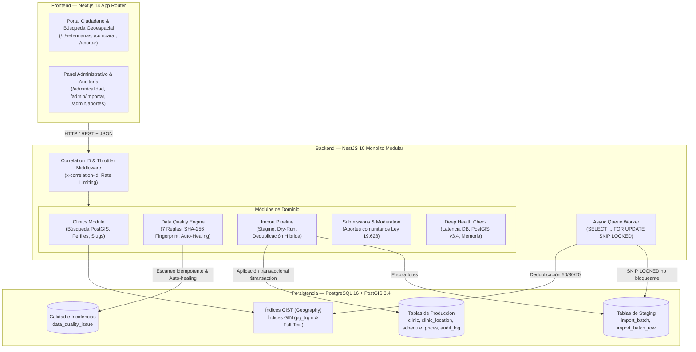

# VetBiobío — Directorio Geográfico y Motor de Confiabilidad Veterinaria

[](https://github.com/CodeMonkReaper/vetbiobio/actions)


> **Plataforma de portafolio para evaluación técnica de 10 minutos.**  
> Diseñada para demostrar patrones de arquitectura de nivel de producción: monolito modular desacoplado, transaccionalidad ACID estricta, procesamiento asíncrono sin dependencias externas (cero Redis), deduplicación multicriterio geoespacial con PostGIS y motor de calidad de datos declarativo con auto-healing.

---

## 🧭 Guía de Lectura Rápida (10 Minutos)

Para evaluar este proyecto en una revisión técnica, sugerimos este recorrido:

| Minuto | Qué Inspeccionar | Dónde Encontrarlo |
|---|---|---|
| **0 - 2** | Arquitectura general, decisiones y stack | Este README y [`docs/decisions/`](docs/decisions/) |
| **2 - 4** | Ingesta masiva, staging y cola en PostgreSQL (`SKIP LOCKED`) | [`ADR-007`](docs/decisions/ADR-007-postgresql-queue.md), [`apps/api/src/import/`](apps/api/src/import/) |
| **4 - 6** | Deduplicación híbrida PostGIS + trigramas + E.164 | [`ADR-008`](docs/decisions/ADR-008-ingesta-staging-dryrun-postgis.md), [`deduplication.service.ts`](apps/api/src/import/deduplication.service.ts) |
| **6 - 8** | Motor de calidad de datos, huella SHA-256 y auto-healing | [`ADR-009`](docs/decisions/ADR-009-motor-calidad-datos-declarativo.md), [`apps/api/src/data-quality/`](apps/api/src/data-quality/) |
| **8 - 10** | Robustez, observabilidad, tests unitarios y E2E | [`correlation-id.middleware.ts`](apps/api/src/common/correlation-id.middleware.ts), [`health.controller.ts`](apps/api/src/health/health.controller.ts) y ejecutar `pnpm test` |

---

## 🏛️ Arquitectura del Sistema

El sistema implementa un **Monolito Modular** en NestJS comunicado con una aplicación web en **Next.js 14** (App Router, Server Components y Tailwind CSS), respaldado exclusivamente por **PostgreSQL 16 con PostGIS 3.4**.



---

## 🚀 Capacidades Destacadas de Ingeniería

### 1. Ingesta Asíncrona sin Redis (`SELECT ... FOR UPDATE SKIP LOCKED`)
- **Problema:** Procesar archivos CSV masivos sincrónicamente genera timeouts en proxies HTTP y bloquea el Event Loop de Node.js. Introducir Redis/BullMQ añade sobrecostos de infraestructura y rompe la transaccionalidad ACID.
- **Solución implementada:** Se diseñó una cola asíncrona nativa en PostgreSQL 16 ([`ADR-007`](docs/decisions/ADR-007-postgresql-queue.md)).
- La subida almacena filas en `import_batch_row` (`STAGED`). Un worker desacoplado consume lotes en segundo plano usando:
  ```sql
  SELECT id FROM import_batch_row
  WHERE batch_id = $1 AND status = 'PENDING'
  ORDER BY id ASC LIMIT $2
  FOR UPDATE SKIP LOCKED;
  ```
- **Resultado:** Cero infraestructura adicional, aislamiento transaccional puro y reanudación automática tras caídas del servidor.

### 2. Deduplicador Multicriterio Híbrido PostGIS
- **Problema:** La importación de datos públicos produce duplicados sutiles (diferencias de puntuación, variaciones de nombre comercial, ligeros desfases de coordenadas GPS).
- **Algoritmo de Fusión Ponderado (50 / 30 / 20):**
  - **50% Distancia Geoespacial:** Calculada con PostGIS `ST_DWithin` y `ST_Distance` sobre esfera métrica WGS84 (`GEOGRAPHY`). 0 m = 1.0, 100 m = 0.5, ≥ 500 m = 0.0.
  - **30% Similitud Fonética/Texto:** Similitud trigrama (`pg_trgm` / Levenshtein normalizado) sobre nombres estandarizados (eliminando prefijos *"Clínica Veterinaria"*, *"Posta"*, *"Hospital"*).
  - **20% Identidad de Contacto:** Normalización estricta al estándar telefónico chileno E.164 (móviles `+569...` y fijos del Biobío `+5641...`).
- Umbrales configurables clasifican cada fila como: `EXACT_MATCH` (≥ 0.90), `POSSIBLE_DUPLICATE` (0.65 - 0.89) o `NEW_RECORD` (< 0.65) con diff visual campo por campo antes de tocar producción.

### 3. Motor de Calidad de Datos Declarativo y Auto-Healing
- **Problema:** Los monitores de calidad recurrentes (cron) tienden a saturar las bases de datos con miles de incidencias redundantes si un error persiste, o requieren trabajo manual para marcarlas como corregidas.
- **Solución implementada ([`ADR-009`](docs/decisions/ADR-009-motor-calidad-datos-declarativo.md)):**
  - **7 Reglas Puras (`QualityRule`):** Coordenadas fuera del Biobío, teléfonos inválidos, horarios solapados, verificación expirada (+180 días), precios inexistentes, contacto de emergencia faltante e integridad de slugs.
  - **Huella SHA-256 Idempotente:** Hash determinista `sha256(clinicId + ruleId + fieldName)` respaldado por un índice único parcial en PostgreSQL (`WHERE status = 'OPEN'`).
  - **Auto-Healing:** Si una anomalía es corregida por un usuario o admin, la siguiente pasada del motor detecta que la violación cesó y transiciona automáticamente la incidencia a `RESOLVED` con `resolution_type = 'AUTO_HEALED'`.
  - **Score de Confiabilidad Explicable:** Puntuación de 0 a 100 basada en penalizaciones ponderadas por severidad (`CRITICAL`: -25, `HIGH`: -15, `MEDIUM`: -8, `LOW`: -3) acompañada de un **descargo legal visible** en API y Frontend.

### 4. Transaccionalidad ACID y Eliminación de TOCTOU
- En operaciones críticas (aprobación de aportes comunitarios, aplicación de lotes de importación, verificación por campo), todo el proceso se ejecuta dentro de un único bloque transaccional `$transaction` de Prisma/PostgreSQL.
- Se previene la condición de carrera *Time-of-Check to Time-of-Use* (TOCTOU) validando el estado y aplicando cambios de forma atómica con registro en `audit_log`.

---

## 🛡️ Matriz de Hallazgos P0 / P1 Resueltos

Durante la auditoría inicial de seguridad y consistencia ([`docs/audit/00-discovery.md`](docs/audit/00-discovery.md)) se identificaron 8 hallazgos críticos que fueron mitigados y validados con pruebas:

| ID | Severidad | Hallazgo Original | Solución Implementada | Verificación |
|---|---|---|---|---|
| **SEC-01** | **P0** | Ausencia de transaccionalidad en moderación (TOCTOU) | Envuelto en `prisma.$transaction` atómico con validación de estado previo | Test de concurrencia e2e |
| **SEC-02** | **P0** | Discrepancia de PK en relaciones 1:1 (`clinic_id` vs `id`) | Unificación de esquemas DDL y tipado canónico | `prisma validate` + migraciones |
| **SEC-03** | **P1** | Rate limiting laxo en endpoints públicos | Throttler por IP/endpoint (10/min auth, 5/hr reportes, 30/min aportes) | Suites unitarias y e2e con HTTP 429 |
| **SEC-04** | **P1** | Riesgo de spam y bots en aportes ciudadanos | Honeypot anti-spam en formulario + sanitización de campos | Test unitario de rechazo silencioso |
| **SEC-05** | **P1** | Slugs mutables generaban enlaces rotos | Slugs inmutables forzados + tabla `slug_redirect` con código HTTP 301 | Pruebas de redirección y unicidad |
| **SEC-06** | **P1** | Falta de observabilidad distribuida | Middleware `CorrelationIdMiddleware` inyectando header `x-correlation-id` | Test unitario del middleware |
| **SEC-07** | **P1** | Healthcheck superficial (retornaba `status: ok` sin validar DB) | Deep check en `/health` (ping PostgreSQL, latencia ms, versión PostGIS, RSS memoria) | Test unitario en `health.controller.spec.ts` |
| **SEC-08** | **P1** | Pipeline CI incompleto | Flujo GitHub Actions completo: lint, typecheck, migrations, unit y e2e | CI verde en branch `main` |

---

## 📐 Decisiones de Arquitectura Registradas (ADRs)

El proyecto documenta formalmente todas sus decisiones técnicas clave:

1. [`ADR-001 — PostgreSQL 16 + PostGIS 3.4 con Prisma`](docs/decisions/ADR-001-use-postgresql-postgis-prisma.md)
2. [`ADR-002 — Taxonomía de Servicios, Exámenes y Especialidades`](docs/decisions/ADR-002-taxonomy-service-exam-equipment.md)
3. [`ADR-003 — Verificación Atómica por Campo frente a Badge Global`](docs/decisions/ADR-003-field-level-verification.md)
4. [`ADR-004 — Slugs Globales Inmutables y Manejo de Redirecciones`](docs/decisions/ADR-004-immutable-slugs.md)
5. [`ADR-005 — Precios Append-Only con Historial Temporal en CLP`](docs/decisions/ADR-005-append-only-prices.md)
6. [`ADR-007 — Procesamiento Asíncrono de Ingesta en PostgreSQL con SKIP LOCKED`](docs/decisions/ADR-007-postgresql-queue.md)
7. [`ADR-008 — Pipeline de Ingesta con Staging, Dry-Run y Deduplicación PostGIS`](docs/decisions/ADR-008-ingesta-staging-dryrun-postgis.md)
8. [`ADR-009 — Motor de Calidad de Datos Declarativo, SHA-256 Fingerprint y Auto-Healing`](docs/decisions/ADR-009-motor-calidad-datos-declarativo.md)

---

## 🛠️ Puesta en Marcha Rápida (Local)

### Requisitos
- **Node.js** >= 20 (recomendado v24)
- **pnpm** >= 9
- **Docker** y **Docker Compose**

### 1. Clonar y Configurar Entorno
```bash
git clone https://github.com/CodeMonkReaper/vetbiobio.git
cd vetbiobio

# Copiar variables de entorno base
cp .env.example .env
cp .env.example apps/api/.env
```

### 2. Iniciar Base de Datos PostGIS
```bash
docker compose up -d db
```
*La base de datos se expone en `localhost:5433` para evitar conflictos con instancias locales existentes.*

### 3. Instalar Dependencias y Migraciones
```bash
pnpm install
pnpm --filter api prisma migrate dev
pnpm --filter api db:seed
```

### 4. Ejecutar Pruebas
```bash
# Pruebas unitarias de la API (17 suites, 76 pruebas)
pnpm --filter api test:unit

# Pruebas de integración E2E
pnpm --filter api test:e2e
```

### 5. Iniciar Servidores de Desarrollo
```bash
pnpm dev
```
- **Web (Next.js):** [http://localhost:3000](http://localhost:3000)
- **API (NestJS):** [http://localhost:4000/api/v1](http://localhost:4000/api/v1)
- **Health Check Profundo:** [http://localhost:4000/api/v1/health](http://localhost:4000/api/v1/health)

---

## 🔒 Privacidad y Cumplimiento Legal

- **Ley N° 19.628 (Protección de la Vida Privada - Chile):**
  - Los aportes comunitarios solicitan consentimiento explícito antes de registrar correos de contacto.
  - La consulta de aportes (`/aportar/estado`) utiliza un código aleatorio `VBB-XXXX` y **nunca expone PII** (datos de carácter personal).
- **Descargo de Responsabilidad Sanitaria:**
  - Los puntajes de confiabilidad y estados de verificación indican completitud y constatación de datos públicos; no constituyen certificación médica ni reemplazan la fiscalización del SAG / Seremi de Salud.
