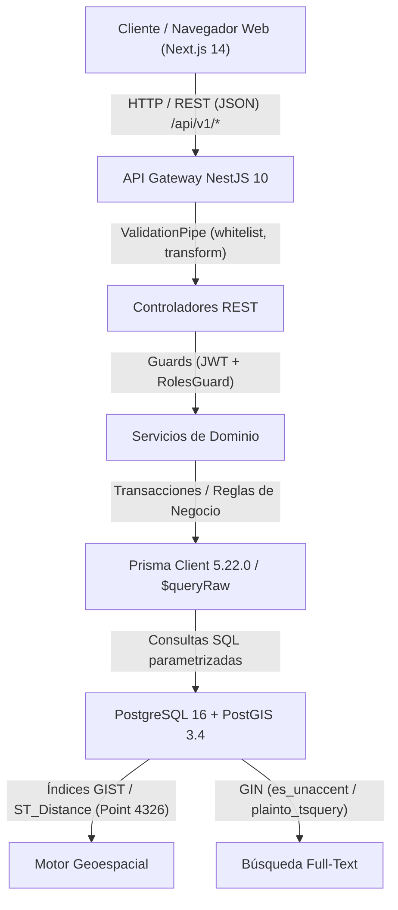

# Informe de Auditoría — Fase 0: Descubrimiento y Auditoría Acotada
**Proyecto:** VetBiobío — Directorio Geográfico de Clínicas Veterinarias de la Región del Biobío  
**Fecha:** Octubre 2026  
**Auditor:** Antigravity (Pair Programming / Security & Architecture Audit)  
**Modo:** Solo lectura (Inspección estática de código, esquemas de BD, infraestructura CI/Docker y configuraciones)  
**Estado:** Finalizado — Pendiente de revisión y aprobación para Fase 1  

---

## 1. Mapa del Sistema y Verificación de Stack

### 1.1 Estructura Monorepo y Paquetes
El proyecto está estructurado como un monorepo administrado con `pnpm` (versión verificada `9.0.0`) y `Node.js` (entorno local verificado `v24.18.0`, CI configurado en `v20`):

```
VetBioBio/
├── apps/
│   ├── api/                 # Monolito modular NestJS 10 (puerto 3001)
│   │   ├── prisma/          # Esquema Prisma 5.22.0 + Migraciones SQL manuales (0000–0009)
│   │   ├── src/             # Módulos de dominio y controladores REST
│   │   └── test/            # Configuración de pruebas Unitarias (Jest) y E2E
│   └── web/                 # Aplicación Next.js 14.2.35 (puerto 3000)
│       ├── src/app/         # App Router (vistas públicas y panel administrativo)
│       ├── src/components/  # Componentes de diseño y mapas interactivos
│       └── e2e/             # Pruebas End-to-End con Playwright
├── docs/                    # Documentación arquitectónica, decisiones (ADRs) y políticas
├── infra/
│   ├── docker/              # Dockerfiles de API y Web
│   └── scripts/             # Scripts SQL de semillas (geo, catálogos, piloto)
├── .github/workflows/       # Pipeline de Integración Continua (ci.yml)
├── docker-compose.yml       # Orquestación local para PostgreSQL/PostGIS y servicios
└── package.json             # Raíz del workspace pnpm
```

### 1.2 Módulos de NestJS y Arquitectura de Dominio
La API está estructurada en un monolito modular con separación de responsabilidades:
- `PrismaModule`: Cliente de acceso a base de datos y ciclo de vida de conexión.
- `AuditModule`: Servicio centralizado para trazabilidad de mutaciones administrativas (`audit_log`).
- `AuthModule`: Autenticación con JWT Bearer, hashing de contraseñas con `bcrypt`, guardias `JwtAuthGuard` y `RolesGuard` (`ADMIN`, `EDITOR`).
- `ClinicsModule`: Catálogo principal, perfiles, repositorios espaciales (`ClinicsGeoRepository`), cálculo de distancias y horarios vigentes.
- `PricesModule`: Gestión de precios append-only con validación de tipos (`FIXED`, `RANGE`, `FROM`, `CONTACT`).
- `SchedulesModule`: Horarios regulares y nocturnos por clínica.
- `VerificationsModule`: Máquina de estados para verificación granular de entidades (`VerificationService`).
- `ReportsModule`: Recepción y moderación de reportes ciudadanos sobre discrepancias de datos.
- `MediaModule`: Carga y asociación de fotografías con Cloudinary.
- `MonetizationModule`: Gestión de suscripciones destacadas y banners publicitarios.
- `SubmissionsModule`: Canal público de aportes ciudadanos (`POST /submissions`) y bandeja de moderación administrativa transaccional (`/admin/submissions`).

### 1.3 Flujo de Datos: Frontend → API → Prisma/SQL → PostGIS


1. **Frontend**: Next.js 14 con App Router (Server Components para SEO en perfiles públicos; Client Components interactivos en buscadores, mapas Mapbox y administración).
2. **API**: NestJS 10 con prefijo global `/api/v1`. Interceptor de respuesta estándar, filtro de excepciones HTTP y `ValidationPipe` global con sanitización activa.
3. **Capa de Persistencia**: Híbrido entre Prisma ORM para entidades tipadas simples (`User`, `AuditLog`, `Submission`) y SQL crudo parametrizado (`$queryRaw`, `$executeRawUnsafe`) para funciones geoespaciales avanzadas de PostGIS (`ST_Distance`, `ST_MakePoint`, `location::geography`) y búsquedas de texto completo (`ts_rank`, `es_unaccent`).
4. **Base de Datos**: PostgreSQL 16 con extensión PostGIS 3.4 (`postgis/postgis:16-3.4`). Coordenadas espaciales almacenadas en `GEOGRAPHY(Point, 4326)` con índices `GIST`.

### 1.4 Autenticación, Autorización y Control de Acceso
- **Autenticación**: Emisión de JSON Web Tokens (JWT) firmados con secreto simétrico (`JWT_SECRET`). Expiración por token y extracción vía header `Authorization: Bearer <token>`.
- **Autorización**: Roles tipados `ADMIN` y `EDITOR` validados a nivel de controlador con `@UseGuards(JwtAuthGuard, RolesGuard)` y decorador `@Roles(...)`.
- **Trazabilidad de Auditoría**: Decorador `@CurrentUser()` inyecta el `userId` autenticado hacia `audit.record()` para registrar el actor en cada mutación administrativa.

### 1.5 Configuración y Secretos
- Centralizado a través de `@nestjs/config` cargando variables de entorno en runtime.
- Los archivos `.env` y `.env.local` están estrictamente ignorados en `.gitignore`.
- Se mantiene una plantilla de ejemplo versionada `.env.example` con variables declaradas y valores dummy/vacíos.

### 1.6 Estrategia de Pruebas y Pipeline de CI
- **Pruebas Unitarias**: Jest en `apps/api` (evaluando DTOs, cálculo de vigencias y reglas de precios); Vitest en `apps/web` (validando componentes UI y helpers de formato).
- **Pruebas de Integración y E2E**: Jest E2E con Supertest en la API; Playwright con Chromium headless para flujos web completos.
- **Pipeline de CI**: GitHub Actions (`.github/workflows/ci.yml`) ejecutando contenedor de servicio Postgres+PostGIS, ejecución secuencial de migraciones SQL y scripts de semillas, linters, compilación TypeScript de ambos paquetes y suites de tests.

### 1.7 Versiones Reales Verificadas del Ecosistema

| Componente | Versión Declarada | Versión Real Verificada | Estado |
|---|---|---|---|
| **Node.js** | 20+ | `v24.18.0` (Local) / `v20.x` (CI/Docker) | Confirmado |
| **pnpm** | 9+ | `9.0.0` | Confirmado |
| **Docker Engine** | 24+ | `29.6.1` (build 8900f1d) | Confirmado |
| **PostgreSQL** | 16 | `16.0` (Debian 16-3.4.2) | Confirmado |
| **PostGIS** | 3.4 | `3.4.2` | Confirmado |
| **NestJS** | 10 | `10.4.15` (`@nestjs/core`) | Confirmado |
| **Next.js** | 14 | `14.2.35` | Confirmado |
| **Prisma ORM** | 5 | `5.22.0` | Confirmado |
| **Playwright** | 1.x | `1.63.0` | Confirmado |

---

## 2. Matriz de Hallazgos Críticos y Altos

| ID | Severidad | Prioridad | Confianza | Categoría | Ubicación | Resumen del Problema |
|---|---|---|---|---|---|---|
| **DB-001** | Crítico | **P0** | Alta | SQL / Integridad | `verification.service.ts:33-46` | Clave primaria errónea (`id` vs `clinic_id`) en verificación de ubicaciones causa 500 fatal. |
| **DB-002** | Crítico | **P0** | Alta | SQL / Esquema | `verification.service.ts:43-46` | Columnas inexistentes en `clinic_photo`, `schedule` y precios en query de verificación. |
| **DB-003** | Alto | **P1** | Alta | Concurrencia | `submissions.service.ts:238-402` | Condición de carrera (TOCTOU) en aprobación de aportes permite aprobaciones duplicadas. |
| **DB-004** | Alto | **P1** | Alta | Transacciones / Reglas | `submissions.service.ts:334-385` | Aprobación de precios sin transacción atómica ni validación de reglas CHECK de BD. |
| **API-001** | Alto | **P1** | Alta | Validación / Crash | `search-clinics.dto.ts:10` / `clinics.geo.repository.ts:32` | Casting directo de enum sin validar en query pública provoca crash SQL 500. |
| **SEC-001** | Alto | **P1** | Media | Rate Limiting / DoS | `submissions.controller.ts:9` / `create-submission.dto.ts:26` | `POST /submissions` público sin rate limiting estricto ni validación de payload JSON. |
| **OPS-001** | Alto | **P1** | Alta | Docker / Infra | `docker-compose.yml:15,23` / `api.Dockerfile:6` / `web.Dockerfile:6` | Fallo de build en `docker compose`, lockfile ausente en imágenes y contenedores como `root`. |
| **OPS-002** | Alto | **P1** | Alta | CI / Integridad | `.github/workflows/ci.yml:42-60` | Migración `0009_submissions` omitida en CI y dependencia de geocodificación externa en vivo. |

---

## 3. Detalle Exhaustivo de Hallazgos

### DB-001: Error Fatal 500 al Verificar Ubicaciones por Discrepancia de Primary Key
- **Severidad:** Crítico
- **Prioridad:** P0 (Bloqueante funcional)
- **Confianza:** Confirmado (Alta)
- **Ubicación:** [verification.service.ts:32-46](file:///c:/Users/luis_/OneDrive/Documentos/VetBioBio/apps/api/src/verification/verification.service.ts#L32-L46)
- **Evidencia:**
  En `VerificationService.changeStatus`, la lógica construye consultas dinámicas con la cláusula `WHERE id = $1`:
  ```typescript
  const rows: any[] = await this.prisma.$queryRawUnsafe(
    `SELECT verification_status FROM ${table} WHERE id = $1`, input.entityId,
  );
  ...
  await this.prisma.$executeRawUnsafe(
    `UPDATE ${table} SET verification_status = $2::verification_status ... WHERE id = $1`,
    input.entityId, ...
  );
  ```
  Sin embargo, la definición de la tabla `clinic_location` en la migración `0000_init/migration.sql:47-48` y en PostgreSQL establece:
  ```sql
  CREATE TABLE IF NOT EXISTS clinic_location (
    clinic_id BIGINT PRIMARY KEY REFERENCES clinic(id) ON DELETE CASCADE,
    ...
  ```
  La tabla no posee columna `id`; su clave primaria es `clinic_id`.
- **Escenario de Impacto:**
  Cualquier llamada administrativa para verificar o cambiar el estado de verificación de una ubicación (`PATCH /api/v1/verifications` con `entityType: "clinic_location"`) arroja una excepción no controlada de PostgreSQL (`error: column "id" does not exist`), retornando un HTTP 500 Internal Server Error y haciendo imposible verificar o validar geográficamente cualquier clínica.
- **Corrección Recomendada:**
  Adaptar la resolución del nombre de la columna identificadora primaria según la tabla:
  ```typescript
  const idCol = input.entityType === 'clinic_location' ? 'clinic_id' : 'id';
  ```
  Usar dicho identificador tanto en el `SELECT` de comprobación como en el `UPDATE` final.
- **Prueba de Regresión:**
  Prueba unitaria/integración que invoque `changeStatus` con `entityType: 'clinic_location'` y verifique actualización exitosa sin excepción de SQL.

---

### DB-002: Error Fatal de SQL al Verificar Fotos, Horarios o Precios por Columnas Inexistentes
- **Severidad:** Crítico
- **Prioridad:** P0 (Bloqueante funcional)
- **Confianza:** Confirmado (Alta)
- **Ubicación:** [verification.service.ts:43-46](file:///c:/Users/luis_/OneDrive/Documentos/VetBioBio/apps/api/src/verification/verification.service.ts#L43-L46)
- **Evidencia:**
  `VerificationService.changeStatus` ejecuta una instrucción de actualización universal:
  ```sql
  UPDATE ${table} 
  SET verification_status = $2::verification_status, 
      verified_at = CASE WHEN $2::verification_status = 'VERIFIED' THEN now() ELSE verified_at END, 
      verification_source = COALESCE($3::verification_source, verification_source), 
      next_review_at = COALESCE($4::date, next_review_at) 
  WHERE id = $1
  ```
  Al cruzar con las definiciones de base de datos (`0001_catalogs` y `0002_admin`):
  1. `clinic_photo` no tiene columnas `verified_at`, `verification_source` ni `next_review_at`.
  2. `schedule` no tiene columnas `verification_source` ni `next_review_at`.
  3. `clinic_service_price` y `clinic_exam_price` nombran la columna como `source`, no `verification_source`, y no tienen `next_review_at`.
- **Escenario de Impacto:**
  Cualquier moderador o administrador que intente verificar precios de servicios, precios de exámenes, horarios o fotografías a través del panel administrativo recibe un HTTP 500 (`column "verification_source" does not exist` o `column "next_review_at" does not exist`).
- **Corrección Recomendada:**
  Construir la sentencia `UPDATE` de forma dinámica y consciente del esquema según la entidad verificable, actualizando únicamente las columnas soportadas por cada tabla respectiva (o estandarizar las columnas en el esquema de la base de datos mediante migración controlada si se requiere registrar vigencia en todas).
- **Prueba de Regresión:**
  Prueba parametrizada que ejecute `changeStatus` para cada uno de los elementos de `VERIFIABLE` (`clinic_photo`, `schedule`, `clinic_service_price`, etc.) y valide la ejecución exitosa de la consulta SQL.

---

### DB-003: Condición de Carrera (TOCTOU) en la Aprobación Administrativa de Aportes
- **Severidad:** Alto
- **Prioridad:** P1
- **Confianza:** Confirmado (Alta)
- **Ubicación:** [submissions.service.ts:238-402](file:///c:/Users/luis_/OneDrive/Documentos/VetBioBio/apps/api/src/submissions/submissions.service.ts#L238-L402)
- **Evidencia:**
  En `SubmissionsService.adminApprove`:
  ```typescript
  // 1. Lectura fuera de transacción
  const sub = await this.prisma.submission.findUnique({ where: { id: BigInt(id) } });
  if (sub.status !== 'PENDING') throw new BadRequestException('El aporte ya fue procesado');

  // 2. Aplicación de cambios (creación de clínicas, inserción de precios, etc.)
  ...

  // 3. Actualización de estado al final
  const reviewed = await this.prisma.submission.update({
    where: { id: BigInt(id) },
    data: { status: 'APPROVED', ... }
  });
  ```
- **Escenario de Impacto:**
  Si dos administradores revisan concurrentemente la misma bandeja de aportes o hacen doble clic en "Aprobar", o si ocurren dos peticiones paralelas:
  Ambos hilos leen `status === 'PENDING'`, ambos proceden a crear clínicas nuevas o a insertar precios de forma duplicada, y ambos sobrescriben el registro. Esto rompe la idempotencia y causa duplicación de registros en producción.
- **Corrección Recomendada:**
  Implementar actualización condicional atómica o bloqueo pesimista en base de datos:
  ```typescript
  const updatedCount = await this.prisma.submission.updateMany({
    where: { id: BigInt(id), status: 'PENDING' },
    data: { status: 'PROCESSING' } // o iniciar dentro de una transacción con SELECT ... FOR UPDATE
  });
  if (updatedCount.count === 0) throw new BadRequestException('El aporte ya fue procesado o está en curso');
  ```
- **Prueba de Regresión:**
  Prueba de concurrencia ejecutando dos peticiones `adminApprove` simultáneas sobre la misma submission mediante `Promise.all()`, esperando exactamente un `200 OK` y un `400 Bad Request`.

---

### DB-004: Inserción de Precios sin Transacción Atómica ni Validación de Reglas CHECK
- **Severidad:** Alto
- **Prioridad:** P1
- **Confianza:** Confirmado (Alta)
- **Ubicación:** [submissions.service.ts:334-385](file:///c:/Users/luis_/OneDrive/Documentos/VetBioBio/apps/api/src/submissions/submissions.service.ts#L334-L385)
- **Evidencia:**
  En `SubmissionsService.adminApprove` al procesar `UPDATE_PRICE`:
  ```typescript
  // 1. Cierra el precio anterior
  await this.prisma.clinicServicePrice.updateMany({
    where: { clinicServiceId: clinicService.id, validUntil: null },
    data: { validUntil: yesterday },
  });

  // 2. Inserta el nuevo precio sin validar reglas de montos
  const newPrice = await this.prisma.clinicServicePrice.create({
    data: {
      clinicServiceId: clinicService.id,
      pricingType: payload.pricingType || 'FIXED',
      minAmount: payload.minAmount ? Number(payload.minAmount) : null,
      maxAmount: payload.maxAmount ? Number(payload.maxAmount) : null,
      source: 'COMMUNITY',
      validFrom: today,
    },
  });
  ```
  Estas operaciones se ejecutan de manera secuencial sin estar envueltas en `$transaction()`. Adicionalmente, la base de datos posee restricciones CHECK estrictas (`0001_catalogs:76-80`):
  `CHECK (pricing_type <> 'FIXED' OR (min_amount IS NOT NULL AND min_amount = max_amount))`
- **Escenario de Impacto:**
  Si un aporte de precio envía tipo `FIXED` con `minAmount: 15000` y `maxAmount: null` (o vacío), la instrucción `create` falla por violación de la restricción `valid_pricing`. Sin embargo, la instrucción previa `updateMany` ya se ejecutó y confirmó, dejando el precio previo cerrado permanentemente en el pasado (`validUntil = yesterday`). La clínica queda sin ningún precio activo en el buscador y el sistema entra en un estado corrupto e inconsistente.
- **Corrección Recomendada:**
  1. Utilizar la función ya existente `validatePriceAmounts` (definida en `prices/price-rules.ts`) antes de realizar cualquier mutación.
  2. Ejecutar el cierre del precio anterior y la creación del nuevo precio estrictamente dentro de un bloque `this.prisma.$transaction(async (tx) => ...)`.
- **Prueba de Regresión:**
  Prueba unitaria/integración intentando aprobar un precio con montos inválidos: verificar que la transacción revierte por completo y que el precio vigente previo permanece intacto con `validUntil: null`.

---

### API-001: Excepción No Controlada (500) por Entrada Inválida en Parámetro `species`
- **Severidad:** Alto
- **Prioridad:** P1
- **Confianza:** Confirmado (Alta)
- **Ubicación:** [search-clinics.dto.ts:10](file:///c:/Users/luis_/OneDrive/Documentos/VetBioBio/apps/api/src/clinics/dto/search-clinics.dto.ts#L10) y [clinics.geo.repository.ts:32](file:///c:/Users/luis_/OneDrive/Documentos/VetBioBio/apps/api/src/clinics/clinics.geo.repository.ts#L32)
- **Evidencia:**
  En `SearchClinicsDto`:
  ```typescript
  @IsOptional() @IsString() species?: string; // DOG|CAT|... (animal_species)
  ```
  En `ClinicsGeoRepository.searchNearby`:
  ```typescript
  if (q.species) conds.push(Prisma.sql`EXISTS (SELECT 1 FROM clinic_animal ca WHERE ca.clinic_id = c.id AND ca.species = ${q.species}::animal_species)`);
  ```
- **Escenario de Impacto:**
  Cualquier usuario o bot que acceda a la URL pública `GET /api/v1/clinics?species=perros` o un valor que no pertenezca al enum PostgreSQL `animal_species` evade la validación del DTO (porque es un string válido). Sin embargo, al ejecutar la consulta en PostgreSQL, el cast directo `::animal_species` genera un error fatal: `ERROR: invalid input value for enum animal_species: "perros"`, provocando una respuesta HTTP 500 no controlada en un endpoint público crítico.
- **Corrección Recomendada:**
  Utilizar `@IsEnum(AnimalSpecies)` o `@IsIn(['DOG', 'CAT', 'EXOTIC_BIRD', 'EXOTIC_MAMMAL', 'EXOTIC_REPTILE', 'EQUINE', 'BOVINE', 'OTHER'])` en `SearchClinicsDto`, garantizando que el `ValidationPipe` rechace la entrada con HTTP 400 Bad Request antes de tocar la base de datos.
- **Prueba de Regresión:**
  Llamada HTTP `GET /api/v1/clinics?species=valor_invalido` que debe responder estrictamente con código de estado HTTP 400.

---

### SEC-001: Ausencia de Rate Limiting Estricto y Validación de Esquema en `POST /submissions`
- **Severidad:** Alto
- **Prioridad:** P1
- **Confianza:** Confirmado (Media-Alta)
- **Ubicación:** [submissions.controller.ts:9-12](file:///c:/Users/luis_/OneDrive/Documentos/VetBioBio/apps/api/src/submissions/submissions.controller.ts#L9-L12) y [create-submission.dto.ts:25-27](file:///c:/Users/luis_/OneDrive/Documentos/VetBioBio/apps/api/src/submissions/dto/create-submission.dto.ts#L25-L27)
- **Evidencia:**
  1. El endpoint `POST /submissions` es público y carece de un decorador `@Throttle()` personalizado para limitar a 5 envíos por hora por IP (únicamente se aplica el throttler global general de 60 req/min).
  2. En `CreateSubmissionDto`:
     ```typescript
     @IsObject()
     payload!: Record<string, any>;
     ```
     No existe validación de la profundidad ni del esquema interno del payload según el tipo de aporte (`NEW_CLINIC`, `UPDATE_PRICE`, etc.).
  3. No se implementa campo honeypot oculto para atrapar bots automatizados.
- **Escenario de Impacto:**
  Un atacante o script automatizado puede enviar miles de aportes basura por minuto con objetos JSON de gran tamaño, llenando la tabla `submission`, saturando la bandeja de entrada del personal administrativo y degradando el almacenamiento de la base de datos.
- **Corrección Recomendada:**
  1. Configurar `@Throttle({ default: { limit: 5, ttl: 3600000 } })` en el endpoint.
  2. Validar payloads específicos según el `type` mediante validadores dedicados.
  3. Añadir validación de campo honeypot en el DTO (rechazando peticiones si dicho campo viene con texto).
- **Prueba de Regresión:**
  Envío de 6 peticiones consecutivas desde la misma IP verificando respuesta `429 Too Many Requests` en la sexta llamada.

---

### OPS-001: Incompatibilidad de Construcción en `docker-compose.yml` y Contenedores Ejecutados como Root
- **Severidad:** Alto
- **Prioridad:** P1
- **Confianza:** Confirmado (Alta)
- **Ubicación:** [docker-compose.yml:15,23](file:///c:/Users/luis_/OneDrive/Documentos/VetBioBio/docker-compose.yml#L15-L23), [api.Dockerfile:1-8](file:///c:/Users/luis_/OneDrive/Documentos/VetBioBio/infra/docker/api.Dockerfile#L1-L8) y [web.Dockerfile:1-8](file:///c:/Users/luis_/OneDrive/Documentos/VetBioBio/infra/docker/web.Dockerfile#L1-L8)
- **Evidencia:**
  1. En `docker-compose.yml`:
     ```yaml
     api:
       build: ./infra/docker/api.Dockerfile
     web:
       build: ./infra/docker/web.Dockerfile
     ```
     En Docker Compose v2, la propiedad `build:` acepta una ruta a un directorio de contexto, no un archivo Dockerfile directo.
  2. En `api.Dockerfile` y `web.Dockerfile`:
     ```dockerfile
     COPY package.json pnpm-workspace.yaml ./
     ...
     RUN corepack enable && pnpm install --frozen-lockfile ...
     ```
     No se copia `pnpm-lock.yaml`, por lo que el comando `pnpm install --frozen-lockfile` falla inmediatamente al intentar compilar la imagen.
  3. Los procesos dentro del contenedor corren bajo el usuario `root` de Linux.
- **Escenario de Impacto:**
  Un revisor técnico o evaluador que intente levantar el entorno con `docker compose up --build` obtendrá un error fatal de Docker Compose sin poder iniciar los contenedores. Adicionalmente, ejecutar procesos Node.js como `root` en contenedores incumple las directrices de seguridad de infraestructura.
- **Corrección Recomendada:**
  1. Modificar `docker-compose.yml` para utilizar la sintaxis `{ context: ., dockerfile: infra/docker/... }`.
  2. Añadir `pnpm-lock.yaml` a las instrucciones `COPY`.
  3. Crear o cambiar a un usuario no privilegiado (`USER node`) antes de la ejecución de runtime.
- **Prueba de Regresión:**
  Ejecución exitosa de `docker compose build --no-cache` desde la raíz del monorepo.

---

### OPS-002: Omisión de Migración Crítica `0009_submissions` y Dependencia Externa en Pipeline CI
- **Severidad:** Alto
- **Prioridad:** P1
- **Confianza:** Confirmado (Alta)
- **Ubicación:** [.github/workflows/ci.yml:42-60](file:///c:/Users/luis_/OneDrive/Documentos/VetBioBio/.github/workflows/ci.yml#L42-L60)
- **Evidencia:**
  1. En el script de migraciones de `ci.yml`:
     ```bash
     for f in prisma/migrations/0000_init/migration.sql \
              ...
              prisma/migrations/0008_monetization/migration.sql; do
       pnpm exec prisma db execute --file "$f" --schema prisma/schema.prisma
     done
     ```
     La migración `0009_submissions/migration.sql` (que crea la tabla `submission` y añade el enum `COMMUNITY`) no está incluida en la lista.
  2. En la línea 60:
     ```bash
     pnpm exec ts-node --transpile-only scripts/import-csv.ts ../../infra/scripts/piloto-concepcion.csv --commit
     ```
     Este paso ejecuta peticiones HTTP en vivo hacia la API pública de OpenStreetMap Nominatim durante cada ejecución del pipeline de CI.
- **Escenario de Impacto:**
  1. Cualquier prueba automatizada que interactúe con el módulo de aportes fallará en CI por ausencia de la tabla `submission` en la base de datos de pruebas.
  2. Nominatim impone límites estrictos de uso (1 petición/segundo y bloqueo de agentes de integración continua). El pipeline fallará de manera intermitente (flaky CI) por razones ajenas al código.
- **Corrección Recomendada:**
  1. Incluir `prisma/migrations/0009_submissions/migration.sql` en el bucle de migraciones de CI.
  2. Usar un mock de coordenadas precomputadas para los tests del importador en CI en lugar de invocar Nominatim en vivo.
- **Prueba de Regresión:**
  Ejecutar el workflow de GitHub Actions y verificar paso exitoso de todas las fases sin dependencias de red externas.

---

## 4. Qué NO se Revisó (Alcance Honesto)

Para mantener una evaluación rigurosa y transparente ante un revisor técnico:
1. **Secretos en Servicios Externos de Producción:** Se verificó la higiene del repositorio y la ausencia de secretos versionados en Git (`.gitignore` y `.env.example`). No se verificó la vigencia ni los permisos asignados a las credenciales locales de Cloudinary o Mapbox en sus respectivos paneles de administración de terceros.
2. **Pruebas de Carga y Rendimiento Masivo:** No se ejecutaron simulaciones de carga concurrente masiva (>1,000 usuarios concurrentes con herramientas como k6 o Artillery) sobre las consultas geoespaciales `ST_Distance`.
3. **Observabilidad en Producción:** Las variables de Sentry (`SENTRY_DSN`) se encuentran deshabilitadas/vacías en el entorno de desarrollo local, por lo que el reporte de alertas de observabilidad en vivo no fue probado en un entorno de staging.
4. **Validez Jurídica de Términos y Privacidad:** Las páginas legales en `/terminos` y `/privacidad` contienen cláusulas estándar redactadas para portafolio técnico; no han sido sometidas a revisión por un abogado colegiado en la República de Chile.

---

## 5. Fortalezas del Sistema y Buenas Prácticas a Preservar

1. **Diseño Geoespacial Profesional en PostGIS:**
   - Uso de tipos `GEOGRAPHY(Point, 4326)` con índices espaciales `GIST`.
   - Conversiones automáticas de latitud/longitud a geography mediante triggers PostgreSQL (`trg_sync_location`).
   - Consultas de proximidad optimizadas con `ST_Distance` ordenadas y paginadas correctamente.
2. **Integridad Temporal de Precios:**
   - Patrón append-only documentado en ADR-005 con vigencias `valid_from` y `valid_until`.
   - Vistas materializadas/SQL `v_current_service_price` y `v_current_exam_price` con `DISTINCT ON` para consultas ultrarrápidas de precios actuales.
   - Restricciones CHECK en la base de datos que impiden precios negativos o incoherencias entre tipos (`FIXED`, `RANGE`, `FROM`, `CONTACT`).
3. **Búsqueda Full-Text Optimizada para Español:**
   - Diccionario `es_unaccent` con vector precalculado `search_tsv` e índice `GIN` con triggers de sincronización en inserción y actualización.
4. **Auditoría Transaccional Robusta:**
   - Servicio centralizado `AuditService` que registra `userId`, entidad, acción (`CREATE`, `UPDATE`, `VERIFY`, etc.), `oldValues` y `newValues` en formato JSONB.
5. **Defensa en Profundidad en la API:**
   - Configuración global de `ValidationPipe` con `whitelist: true` y `forbidNonWhitelisted: true`, eliminando vectores de Mass Assignment.
   - Protección estricta de rutas administrativas con `@UseGuards(JwtAuthGuard, RolesGuard)` y `@Roles('ADMIN', 'EDITOR')`.
6. **Frontend Moderno y Accesible:**
   - Implementado con Next.js 14 App Router, soporte responsivo, tokens de diseño consistentes, mapas interactivos con Mapbox GL y estados de carga pulidos.

---
*Fin del Informe de Auditoría — Fase 0.*
