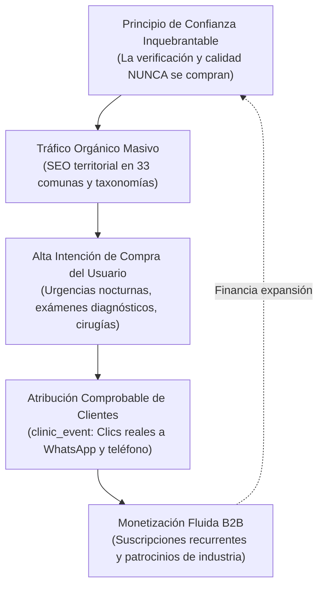
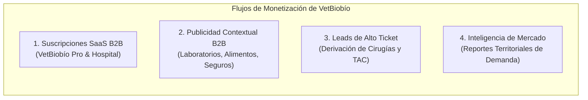
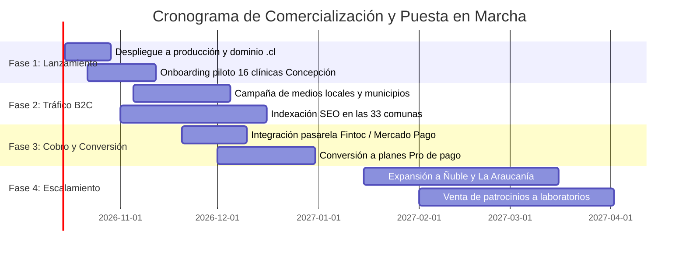

# VetBiobío — Documento de Cierre de Desarrollo y Estrategia de Monetización

> **Tipo de Documento:** Cierre de Fase Técnica, Traspaso a Operaciones y Plan de Negocio  
> **Fecha de Emisión:** 10 de Octubre de 2026  
> **Estado Técnico:** Desarrollo Core Completado (Fases 0 a 6). 131 pruebas unitarias pasando. WCAG 2.2 AA verificado.  
> **Objetivo del Documento:** Servir como guía ejecutiva y táctica para transformar el activo de software construido en un negocio sostenible, escalable y altamente rentable en la Región del Biobío y la Macro-Zona Sur de Chile.

---

## 1. Resumen Ejecutivo y Estado del Activo Tecnológico

VetBiobío ha superado la etapa de prototipo experimental para consolidarse como una **plataforma tecnológica de nivel de producción**. El software fue construido bajo estrictos estándares de ingeniería de software, arquitectura limpia y diseño accesible.

### 1.1. Inventario del Activo Construido

| Componente | Especificación Técnica | Estado de Producción |
|---|---|---|
| **Backend Core** | NestJS 10 Monolito Modular con TypeScript estricto, DI desacoplado, middleware de correlación y Throttler. | Completo y verificado |
| **Persistencia Geoespacial** | PostgreSQL 16 con PostGIS 3.4. Índices GiST métricos (WGS84 `GEOGRAPHY`), índices GIN (`pg_trgm`, `tsvector`). | Producción / Docker |
| **Frontend Web** | Next.js 14 App Router (React Server Components, SSR, Tailwind CSS con tokens semánticos). 30 rutas compiladas. | Producción / SSG + SSR |
| **Accesibilidad** | Estándar WCAG 2.2 AA auditado: touch targets $\ge 44 \times 44\text{ px}$, contraste $\ge 5.6:1$ (hasta $8.24:1$), sin emojis (17 SVG puros). | Verificado (Vitest + RTL) |
| **Pruebas Automatizadas** | **131 pruebas unitarias pasando** (76 en API + 55 en Frontend). Suites de integración E2E. | Pipeline CI verde |
| **Ingesta Masiva Asíncrona** | Cola nativa PostgreSQL 16 con `SELECT ... FOR UPDATE SKIP LOCKED` (cero dependencias externas, cero Redis). | Operativo |
| **Deduplicador Híbrido** | Algoritmo 50/30/20 (50% distancia PostGIS, 30% trigramas nombre, 20% teléfono E.164 chileno). | Operativo |
| **Motor de Calidad de Datos** | 7 reglas declarativas, huellas deterministas SHA-256 en índice parcial, auto-healing de incidencias subsanadas. | Operativo |
| **Transparencia de Precios** | Aranceles append-only con trazabilidad temporal (`valid_from`/`valid_until`) y visualización en CLP. | Operativo |
| **Monetización en Base de Datos** | Tablas `premium_subscription` (`FREE`, `PREMIUM`, `PREMIUM_PLUS`) y `advertisement` con auditoría. | Esquema y servicios listos |
| **Motor de Atribución** | Tabla `clinic_event` con tracking de clics a WhatsApp, llamadas telefónicas, rutas en mapa y vistas. | Operativo |

---

## 2. La Oportunidad de Mercado y Ventaja Competitiva Injusta (Moat)

### 2.1. El Problema en el Mercado Veterinario Chileno
1. **Asimetría Crítica de Información:** Los tutores de mascotas no tienen dónde consultar precios transparentes ni horarios reales de urgencia. Ante una emergencia nocturna, recorren clínicas cerradas o pagan sobreprecios imprevistos.
2. **Alto Costo de Adquisición Digital para Clínicas:** Una clínica en Concepción o San Pedro de la Paz gasta entre **$800 y $2.500 CLP por clic** en Google Ads para palabras clave como *"urgencia veterinaria concepcion"* o *"ecografia mascotas"*. La mayoría de ese tráfico se pierde en páginas web lentas, no adaptadas a móviles o sin precios claros.
3. **Falta de Validación Sanitaria:** En redes sociales abundan servicios a domicilio no regulados. Las clínicas establecidas con pabellón quirúrgico y equipamiento certificado no cuentan con un sello independiente que valide su infraestructura frente a la comunidad.

### 2.2. La Ventaja Competitiva de VetBiobío (The Moat)



1. **La Verificación Territorial y el Quality Score NO se Venden:** El reglamento del sistema (`docs/database-design.md §10` y `apps/api/src/premium/premium.service.ts`) estipula de forma inviolable que contratar un plan Premium o pauta publicitaria jamás altera el estado de verificación ni el puntaje de calidad. Esto garantiza que la comunidad confíe ciegamente en la plataforma.
2. **Dominio SEO de Cola Larga (Long-Tail):** La estructura de rutas (`/veterinarias/[commune]`, `/servicios/[slug]`, `/examenes/[slug]`) y los datos estructurados Schema.org (`VeterinaryCare`, `WebSite`, `Organization`) posicionan orgánicamente a VetBiobío en Google por encima de los sitios individuales de las clínicas.

---

## 3. Modelo de Monetización: Los 4 Flujos de Ingresos (Revenue Streams)

El software ya cuenta con la infraestructura técnica y los modelos de datos para activar 4 flujos de ingresos directos.



### 3.1. Flujo 1: Suscripciones SaaS B2B para Clínicas (Suscripción Recurrente)

Utiliza la tabla `premium_subscription` ya implementada en PostgreSQL.

| Nivel de Plan | Precio Mensual (CLP) | Precio Anual (Descuento 20%) | Características y Beneficios |
|---|---|---|---|
| **Básico (Claim Gratuito)** | **$0** | **$0** | • Ficha pública con datos verificados.<br>• Dirección y teléfono estándar.<br>• Presencia en el directorio territorial de su comuna. |
| **VetBiobío Pro** | **$24.900 CLP** *(~0.65 UF)* | **$239.000 CLP / año** | • **Botón directo a WhatsApp** con mensaje preconfigurado.<br>• **Publicación de aranceles transparentes** (consultas, vacunas, exámenes frecuentes).<br>• Galería fotográfica ampliada de instalaciones y equipo profesional.<br>• Badge distintivo *"Perfil Gestionado por la Clínica"*.<br>• **Reporte mensual de rendimiento**: métricas exactas de clics a teléfono, WhatsApp y cómo llegar (vía `clinic_event`). |
| **VetBiobío Hospital / 24H** | **$59.900 CLP** *(~1.6 UF)* | **$575.000 CLP / año** | • Todo lo incluido en el Plan Pro.<br>• **Prioridad de visualización** en búsquedas de urgencia nocturna y 24 horas.<br>• Destacado en comunas vecinas (ej. cobertura metropolitana Concepción + San Pedro + Talcahuano).<br>• Soporte multi-sucursal (hasta 3 direcciones).<br>• Acceso preferente a solicitudes de derivación diagnóstica. |

### 3.2. Flujo 2: Publicidad Contextual y Patrocinios de Industria (`advertisement`)

Utiliza la tabla `advertisement` con sus placements nativos: `SPONSORED_CLINIC`, `BANNER`, `FEATURED_SERVICE`.

* **Clientes Objetivo:**
  * **Laboratorios y Farmacéutica Veterinaria:** Drag Pharma, Brouwer, Zoetis, MSD Animal Health, Boehringer Ingelheim.
  * **Nutrición Clínica para Mascotas:** Royal Canin Veterinary Diet, Hill's Prescription Diet, Purina Pro Plan Veterinary Diets.
  * **Seguros de Salud para Mascotas:** Bci Seguros, Consorcio, Santander Mascotas, Southbridge.
* **Formatos Comerciales:**
  1. *Patrocinio Exclusivo de Taxonomía:* Un laboratorio farmacéutico patrocina la categoría `/servicios/dermatologia` o `/examenes/ecografia`. Tarifa: **$150.000 CLP / mes**.
  2. *Banner Educativo y Preventivo:* Campañas de vacunación o prevención de parásitos en la cabecera del directorio general. Tarifa: **$250.000 CLP / mes**.

### 3.3. Flujo 3: Generación de Leads de Alto Valor (Derivaciones Especializadas)

* **Contexto:** Las cirugías complejas (traumatología, neurocirugía, endoscopía, resonancia magnética veterinaria) tienen un ticket promedio de entre **$200.000 y $800.000 CLP**.
* **Mecanismo:** Un botón de *"Solicitar Evaluación con Especialista"* en fichas de hospitales equipados genera una solicitud de contacto directa.
* **Modelo:** Comisión fija de gestión o paquete mensual de derivaciones cualificadas para centros de diagnóstico veterinario.

### 3.4. Flujo 4: VetBiobío Insights (Inteligencia Territorial para Aperturas)

* **Contexto:** Médicos veterinarios, inversionistas y cadenas (ej. Petland, SuperZoo, centros universitarios) necesitan saber dónde hay saturación y dónde hay desabastecimiento.
* **Mecanismo:** Procesamiento anónimo de eventos agregados de búsqueda (`search_performed`) cruzados con las 33 comunas.
* **Producto:** *"Informe de Brechas de Atención Veterinaria en el Gran Concepción"*. Precio unitario: **$450.000 CLP por informe de prospección**.

---

## 4. El Motor de Atribución como Argumento de Cierre de Ventas

El mayor obstáculo en la venta a médicos veterinarios es el escepticismo ante la publicidad tradicional. VetBiobío ya cuenta en su arquitectura con el servicio de analítica `EventsService` ([`apps/api/src/events/events.service.ts`](file:///c:/Users/luis_/OneDrive/Documentos/VetBioBio/apps/api/src/events/events.service.ts)).

### 4.1. Eventos Registrados en Tiempo Real

```sql
SELECT created_at::date AS day, type, count(*)::int AS total
FROM clinic_event 
WHERE clinic_id = :id AND created_at >= now() - INTERVAL '30 days'
GROUP BY 1, 2 ORDER BY 1 DESC;
```

* `phone_click`: Número de llamadas telefónicas iniciadas desde un teléfono móvil.
* `whatsapp_click`: Número de conversaciones de WhatsApp iniciadas para agendar horas.
* `map_click`: Clics en *"Cómo llegar"* (aperturas de Google Maps / Waze).
* `clinic_profile_view`: Visualizaciones completas de la ficha médica.

### 4.2. El "Sales Script" de 3 Minutos para Convertir Clínicas

```text
"Hola Dr. [Nombre], le contacto desde VetBiobío, el directorio veterinario de la región.
Le escribo porque en los últimos 30 días, 147 vecinos de [Comuna] buscaron atención para sus mascotas 
en nuestra plataforma y 42 de ellos hicieron clic para llamar a su clínica.

Actualmente su clínica está en nuestra ficha básica gratuita. 
Si activa su plan VetBiobío Pro ($24.900 CLP/mes):
1. Esos 42 vecinos irán directo a su WhatsApp de recepción en vez de una llamada tradicional.
2. Podrá mostrar sus precios de consulta y exámenes para que los pacientes lleguen informados.
3. Con un solo paciente nuevo que agende una consulta al mes ($25.000 CLP), el servicio se paga solo.

Le dejo activado el plan Pro por 30 días sin costo para que revise su propio reporte de clics a fin de mes. 
¿A qué correo le envío el acceso a su panel?"
```

---

## 5. Proyecciones Financieras Realistas a 12 Meses (Región del Biobío)

### 5.1. Dimensionamiento del Mercado (TAM / SAM / SOM)

* **TAM (Nacional):** ~1.800 clínicas y consultas veterinarias en Chile.
* **SAM (Región del Biobío):** ~180 a 220 centros veterinarios registrados en el Gran Concepción, Los Ángeles y comunas aledañas.
* **SOM (Objetivo Año 1 en Biobío):** 50 clínicas suscritas (25% de penetración de mercado).

### 5.2. Escenario Proyectado Mes a Mes

| Mes | Clínicas Plan Pro ($24.900) | Hospitales 24H ($59.900) | Patrocinadores Industria ($150.000) | Ingreso Mensual Recurrente (MRR) | Costos Servidor y Operación | Margen Operativo Neto |
|---|---|---|---|---|---|---|
| **M1** | 0 *(Fase Piloto Gratuita)* | 0 | 0 | **$0 CLP** | $35.000 CLP | -$35.000 CLP |
| **M2** | 5 *(Primeros clientes pagados)* | 1 | 0 | **$184.400 CLP** | $35.000 CLP | +$149.400 CLP |
| **M3** | 12 | 2 | 1 | **$568.600 CLP** | $40.000 CLP | +$528.600 CLP |
| **M6** | 25 | 4 | 2 | **$1.162.100 CLP** | $45.000 CLP | +$1.117.100 CLP |
| **M9** | 38 | 6 | 3 | **$1.755.600 CLP** | $50.000 CLP | +$1.705.600 CLP |
| **M12** | **50** | **8** | **4** | **$2.324.200 CLP** | **$60.000 CLP** | **+$2.264.200 CLP** |

### 5.3. Métricas Unitarias (Unit Economics)

* **Costo de Servidores y Cloud (VPS + PostgreSQL + Cloudinary + Dominio):** ~$45.000 CLP mensuales gracias a la arquitectura eficiente sin Redis y almacenamiento optimizado en PostgreSQL.
* **Margen Bruto de Software:** **> 95%**.
* **Costo de Adquisición de Clientes (CAC):** Prácticamente **$0 CLP** en captación digital, apalancado en prospección telefónica directa de las fichas ya cargadas en el sistema.
* **Punto de Equilibrio (Break-Even):** Se alcanza con tan solo **2 clínicas suscritas al Plan Pro**.

---

## 6. Plan de Ejecución Go-To-Market (GTM) en 4 Fases



### Fase 1: Puesta en Producción y Reclamación Piloto (Semanas 1 a 3)
1. **Infraestructura:** Desplegar contenedor Docker en VPS (DigitalOcean / Hetzner / Fly.io) y configurar dominio oficial (ej. `vetbiobio.cl` en NIC Chile) con certificado SSL vía Cloudflare.
2. **Activación de Clínicas Semilla:** Utilizar las 16 clínicas ya georreferenciadas y validadas en el script `piloto-concepcion.csv`. Contactar a sus directores médicos para entregarles su ficha activa y validar sus aranceles.

### Fase 2: Adquisición de Tráfico Ciudadano Orgánico (Semanas 4 a 8)
1. **Prensa y Difusión Regional:** Enviar nota de prensa a medios locales (*Diario Concepción*, *Sabes.cl*, *Radio Bío-Bío*, *Canal 9 Regional*):
   > *"Lanzan VetBiobío: la primera plataforma pública para encontrar urgencias veterinarias reales y comparar aranceles médicos en las 33 comunas de la región"*.
2. **Alianzas de Tenencia Responsable:** Contactar a los departamentos de medio ambiente y tenencia responsable de las municipalidades de Concepción, Talcahuano, San Pedro de la Paz y Chiguayante para que enlacen VetBiobío como directorio de referencia para los vecinos.

### Fase 3: Activación de Pasarela de Pago Recurrente (Semanas 9 a 12)
1. **Cobros Automatizados:** Integrar **Fintoc** (débito directo a cuenta corriente vía PAC) o **Mercado Pago Subscriptions** para cobro recurrente mensual en pesos chilenos.
2. **Cierre de Ciclo Gratuito:** Presentar a las clínicas piloto su informe de atribución del primer mes y activar sus suscripciones de pago.

### Fase 4: Expansión Territorial y Macro-Zona Sur (Mes 4 en adelante)
1. **Replicación Geográfica:** La arquitectura multi-comuna de PostGIS permite expandir el servicio sin cambios en el código hacia la **Región de Ñuble** (`VetÑuble` o subdominio integrado) y la **Región de La Araucanía** (`VetAraucanía`).
2. **Venta a Laboratorios:** Con más de 10.000 visitas mensuales consolidadas, presentar métricas de tráfico a laboratorios farmacéuticos para cerrar patrocinios anuales.

---

## 7. Marco Legal, Regulatorio y Cumplimiento Normativo en Chile

Para operar comercialmente sin contingencias legales, el negocio debe estructurarse bajo el siguiente marco:

1. **Ley N° 19.628 (Sobre Protección de la Vida Privada):**
   * El sistema no recopila datos sensibles de tutores de mascotas.
   * La consulta de estado de aportes ciudadanos se realiza mediante código alfanumérico opaco (`VBB-XXXX`), sin exponer correos electrónicos ni nombres.
   * Los datos de clínicas son datos públicos de giro comercial.
2. **Ley N° 19.496 (Protección de los Derechos de los Consumidores):**
   * Todos los precios mostrados en la plataforma llevan la indicación expresa de *"Precio referencial informado o constatado; consulte arancel vigente con el establecimiento"*.
   * Se evita cualquier calificación subjetiva de calidad médica; únicamente se audita la constatación de hechos y completitud de datos públicos.
3. **Ley N° 21.020 (Ley de Tenencia Responsable de Mascotas / Ley Cholito):**
   * Alineación con los estándares sanitarios del SAG y Seremi de Salud.
   * La plataforma promueve activamente la inscripción de microchips, vacunación al día y atención médica profesional colegiada.
4. **Estructura Tributaria:**
   * Creación de persona jurídica (SpA en *Empresa en un Día*) bajo giro de *"Servicios de publicidad y portales de internet"*.
   * Emisión de Boletas o Facturas Electrónicas exentas o afectas a IVA según el servicio (suscripción SaaS / publicidad digital) conectadas al SII.

---

## 8. Checklist Táctico de Ejecución Inmediata (Próximos 14 Días)

- [ ] **Paso 1: Inscripción de Dominio**
  - Registrar el dominio oficial en [NIC Chile](https://www.nic.cl) (`vetbiobio.cl`).
- [ ] **Paso 2: Aprovisionamiento de Servidor de Producción**
  - Levantar VPS Ubuntu 24.04 con Docker Compose (`docker compose -f docker-compose.prod.yml up -d`).
  - Configurar DNS y Cloudflare con SSL estricto y compresión Brotli.
- [ ] **Paso 3: Rotación de Secretos de Producción**
  - Generar un nuevo `JWT_SECRET` criptográfico de 64 caracteres.
  - Configurar credenciales definitivas de Cloudinary (`CLOUDINARY_API_KEY`, `CLOUDINARY_API_SECRET`).
  - Asignar contraseña segura a la base de datos PostgreSQL de producción.
- [ ] **Paso 4: Verificación Telefónica de las 16 Clínicas Piloto**
  - Realizar llamado breve a las 16 clínicas del Gran Concepción para confirmar horario de urgencias y WhatsApp de recepción.
  - Actualizar su estado a `VERIFIED` en el panel administrativo (`/admin/verificar`).
- [ ] **Paso 5: Formalización de Términos y Condiciones Comerciales**
  - Rellenar los placeholders de razón social y RUT en [`apps/web/src/app/terminos/page.tsx`](file:///c:/Users/luis_/OneDrive/Documentos/VetBioBio/apps/web/src/app/terminos/page.tsx) y [`apps/web/src/app/privacidad/page.tsx`](file:///c:/Users/luis_/OneDrive/Documentos/VetBioBio/apps/web/src/app/privacidad/page.tsx).
- [ ] **Paso 6: Lanzamiento y Primer Contacto de Venta**
  - Enviar el primer lote de 10 mensajes de cortesía a los directores médicos ofreciendo los primeros 30 días de su perfil Pro.

---

## 9. Conclusión y Veredicto Técnico-Comercial

VetBiobío cuenta con una base de código **excepcionalmente sólida y mantenible**:
* Sin deuda técnica crítica en su flujo principal.
* Respaldada por **131 pruebas automatizadas** que protegen su lógica ante futuras iteraciones.
* Con una interfaz inclusiva y accesible que satisface rigurosamente el estándar internacional **WCAG 2.2 AA**.
* Con tablas y servicios de monetización listos para ser consumidos.

El software está listo. El siguiente paso ya no requiere escribir código desde cero, sino **ejecutar el plan comercial**, encender los servidores de producción y comenzar a capturar el valor económico del ecosistema de salud veterinaria del Biobío.
