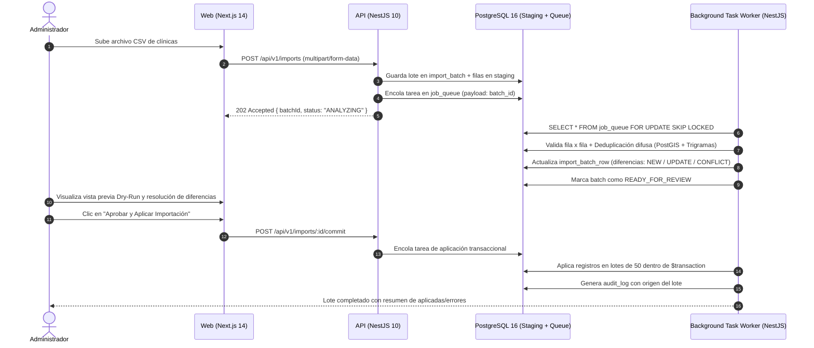

# Plan Integral de Integración y Evolución Arquitectónica
**Proyecto:** VetBiobío — Directorio Geográfico de Clínicas Veterinarias de la Región del Biobío  
**Documento:** Plan de Integración Técnica y Madurez Operativa  
**Fecha:** Octubre 2026  
**Versión:** 1.0.0  
**Autor:** Antigravity (Pair Programming / Arquitectura & Seguridad)  

---

## 1. Visión y Principios Arquitectónicos

El objetivo de este plan es guiar la transición de **VetBiobío** desde un MVP técnico funcional hacia una plataforma de producción madura, con procesos de negocio complejos, alta confiabilidad de datos y automatización operativa. 

Para que cada decisión sea defendible ante un revisor técnico en una entrevista o evaluación de arquitectura, el desarrollo se rige por los siguientes principios:

1. **Monolito Modular en NestJS (No Microservicios Injustificados):**  
   Mantener la cohesión de dominio en un único monorepo. Cada nueva capacidad se integra como un módulo NestJS aislado con interfaces claras (`DataQualityModule`, `ImportModule`, `JobsModule`).
2. **Postgres-First (Sin Infraestructura Externa Prematura):**  
   Antes de introducir Redis, Kafka o brokers de mensajes externos, se aprovechan las capacidades nativas de PostgreSQL 16 y PostGIS:
   - Procesamiento asíncrono y colas de trabajo con `SELECT ... FOR UPDATE SKIP LOCKED`.
   - Búsqueda difusa y deduplicación con extensiones `pg_trgm` y `unaccent`.
   - Consultas espaciales de alta precisión con tipos `GEOGRAPHY(Point, 4326)` e índices `GIST`.
   - Consistencia transaccional ACID estricta para operaciones batch y moderación.
3. **Idempotencia y Consistencia:**  
   Toda operación asíncrona, moderación o importación debe ser idempotente por diseño. Reejecutar un proceso nunca duplica entidades ni corrompe el historial temporal.
4. **Calidad de Datos como Eje Central:**  
   Un directorio sin datos fidedignos pierde su valor. La automatización debe clasificar la integridad del dato, normalizarlo (ej. formato E.164 chileno) y auditar su procedencia (`COMMUNITY`, `OFFICIAL_WEBSITE`, `PHONE`, etc.).
5. **Seguridad y Privacidad por Defecto:**  
   Manejo estricto de secretos, control de acceso basado en roles (`ADMIN`, `EDITOR`), hashing de datos personales (IPs anonimizadas mediante SHA-256 + Salt) y sanitización contra inyecciones SQL y CSV.

---

## 2. Mapa de Integración por Fases

El plan se estructura en 5 fases secuenciales. Cada fase requiere que la anterior esté compilando, probada con suites automatizadas y documentada.

```mermaid
flowchart TD
    subgraph Fase1["Fase 1: Saneamiento y Correcciones P0/P1"]
        F1_1["Corrección DB-001/DB-002: Motor de Verificación"]
        F1_2["Corrección DB-003/DB-004: Concurrencia y Transacciones"]
        F1_3["Corrección API-001/SEC-001: Validación y Rate Limiting"]
        F1_4["Corrección OPS-001/OPS-002: Docker Compose y CI"]
    end

    subgraph Fase2["Fase 2: Motor de Calidad y Confiabilidad (Prioridad 1)"]
        F2_1["Catálogo de Reglas Configurables"]
        F2_2["Evaluador y Ciclo de Vida de Incidencias"]
        F2_3["Score de Confiabilidad Explicable"]
        F2_4["Panel Administrativo de Calidad"]
    end

    subgraph Fase3["Fase 3: Ingesta Avanzada y Cola Asíncrona (Prioridad 2)"]
        F3_1["Tablas de Staging y Parseo Validado"]
        F3_2["Deduplicador Híbrido: Trigramas + PostGIS"]
        F3_3["Modo Dry-Run con Vista de Diferencias"]
        F3_4["Motor de Colas en PostgreSQL (SKIP LOCKED)"]
    end

    subgraph Fase4["Fase 4: Endurecimiento y Material de Portafolio"]
        F4_1["Logging Estructurado y Correlation IDs"]
        F4_2["Pruebas de Concurrencia e Invariantes"]
        F4_3["ADRs Arquitectónicos (ADR-007, ADR-008)"]
        F4_4["README Ejecutivo de Portafolio"]
    end

    subgraph Fase5["Fase 5+: Roadmap de Expansión de Negocio"]
        F5_1["Portal de Gestión para Clínicas"]
        F5_2["Suscripciones y Alertas de Cambios (Outbox)"]
        F5_3["Buscador Avanzado y Ranking Explicable"]
    end

    Fase1 --> Fase2
    Fase2 --> Fase3
    Fase3 --> Fase4
    Fase4 --> Fase5
```



---

## 3. Detalle Técnico de Integración por Módulo

### 3.1 Fase 1: Saneamiento de Base y Correcciones P0/P1
**Objetivo:** Eliminar los 8 riesgos críticos identificados en la auditoría inicial antes de construir capas superiores.

1. **Motor de Verificación Unificado (`verification.service.ts`):**
   - Corregir resolución de clave primaria (`clinic_location` utiliza `clinic_id`; otras tablas utilizan `id`).
   - Generar consultas dinámicas conscientes del esquema: solo actualizar columnas existentes en cada tabla (`clinic_photo` no tiene `verified_at` ni `next_review_at`; precios utilizan `source`, no `verification_source`).
2. **Atomicidad y Concurrencia en Moderación (`submissions.service.ts`):**
   - Sustituir el patrón TOCTOU por una transición atómica:
     ```typescript
     const res = await this.prisma.submission.updateMany({
       where: { id: BigInt(id), status: 'PENDING' },
       data: { status: 'PROCESSING' }
     });
     if (res.count === 0) throw new BadRequestException('Aporte ya procesado o en curso');
     ```
   - Envolver la creación/cierre de precios en un bloque `this.prisma.$transaction()`, invocando `validatePriceAmounts` para garantizar el cumplimiento de las restricciones CHECK (`valid_pricing`).
3. **Validaciones Públicas y Blindaje DoS:**
   - Validar enum `AnimalSpecies` en `SearchClinicsDto` con `@IsEnum(AnimalSpecies)` para evitar errores 500 por casteo en PostgreSQL.
   - Proteger `POST /submissions` con `@Throttle({ default: { limit: 5, ttl: 3600000 } })`, campo honeypot oculto y validadores por tipo de payload.
4. **Infraestructura y Pipeline CI:**
   - Corregir la sintaxis de construcción en `docker-compose.yml` (`context: .`, `dockerfile: ...`).
   - Copiar `pnpm-lock.yaml` en Dockerfiles y ejecutar con usuario sin privilegios `USER node`.
   - Incorporar la migración `0009_submissions` en `.github/workflows/ci.yml` y reemplazar la geocodificación externa en vivo por fixtures precomputados.

---

### 3.2 Fase 2: Motor de Calidad de Datos (Prioridad 1)
**Objetivo:** Evaluar automáticamente la integridad y frescura de los datos, calculando un puntaje explicable y gestionando incidencias de manera idempotente.

#### 3.2.1 Arquitectura del Módulo `DataQualityModule`
```
apps/api/src/data-quality/
├── data-quality.module.ts
├── data-quality.controller.ts       # Endpoints administrativos
├── data-quality.scheduler.ts        # Ejecución programada (cron diario)
├── services/
│   ├── rules-engine.service.ts      # Orquestador de evaluación
│   ├── incident.service.ts          # Ciclo de vida idempotente de incidencias
│   └── clinic-score.service.ts      # Algoritmo de puntaje explicable
└── rules/                           # Unidades atómicas y testeables
    ├── base-rule.interface.ts
    ├── rule-expired-prices.ts
    ├── rule-incomplete-profile.ts
    ├── rule-outdated-verification.ts
    ├── rule-invalid-phone.ts
    ├── rule-duplicate-phone.ts
    ├── rule-schedule-conflict.ts
    └── rule-suspicious-geo.ts
```

#### 3.2.2 Catálogo Inicial de Reglas
| Código Regla | Severidad | Condición Detectada | Acción Recomendada |
|---|---|---|---|
| `RULE_EXPIRED_PRICES` | ALTA | Precios activos con más de 12 meses sin confirmación (`verified_at` o `valid_from`). | Llamar a la clínica para actualizar arancel. |
| `RULE_INCOMPLETE_PROFILE` | MEDIA | Ausencia de teléfono, horario o dirección física. | Completar datos básicos desde fuentes oficiales. |
| `RULE_OUTDATED_VERIFICATION` | ALTA | Fecha `next_review_at < CURRENT_DATE` o verificación con más de 6 meses. | Programar llamada de reverificación telefónica. |
| `RULE_INVALID_PHONE` | CRÍTICA | Teléfono no cumple formato E.164 chileno (+56 9 XXXX XXXX o +56 41 XXX XXXX). | Normalizar número telefónico. |
| `RULE_DUPLICATE_PHONE` | ALTA | El mismo teléfono asignado a dos clínicas distintas en distintas comunas. | Revisar posible duplicación de ficha o sucursal. |
| `RULE_SCHEDULE_CONFLICT` | ALTA | Traslape de horas, apertura > cierre sin flag `is_overnight`, o día sin horas. | Corregir matriz de horarios de la clínica. |
| `RULE_SUSPICIOUS_GEO` | CRÍTICA | Coordenadas fuera del BBOX del Biobío o ubicadas en agua marina (usando PostGIS). | Re-geocodificar dirección física con precisión. |

#### 3.2.3 Modelo de Datos de Incidencias (`data_quality_issue`)
```sql
CREATE TYPE data_quality_severity AS ENUM ('LOW', 'MEDIUM', 'HIGH', 'CRITICAL');
CREATE TYPE data_quality_status AS ENUM ('OPEN', 'RESOLVED', 'DISMISSED');

CREATE TABLE data_quality_issue (
  id BIGINT GENERATED ALWAYS AS IDENTITY PRIMARY KEY,
  clinic_id BIGINT NOT NULL REFERENCES clinic(id) ON DELETE CASCADE,
  rule_code TEXT NOT NULL,
  severity data_quality_severity NOT NULL,
  status data_quality_status NOT NULL DEFAULT 'OPEN',
  cause_description TEXT NOT NULL,
  recommended_action TEXT NOT NULL,
  metadata JSONB,
  fingerprint TEXT NOT NULL, -- sha256(clinic_id + rule_code + target_entity_id) para idempotencia
  first_detected_at TIMESTAMPTZ NOT NULL DEFAULT now(),
  last_evaluated_at TIMESTAMPTZ NOT NULL DEFAULT now(),
  resolved_at TIMESTAMPTZ,
  resolved_by BIGINT REFERENCES "user"(id),
  resolution_notes TEXT,
  CONSTRAINT unique_open_issue UNIQUE (fingerprint, status)
);
CREATE INDEX dq_clinic_status_idx ON data_quality_issue(clinic_id, status);
```

#### 3.2.4 Algoritmo de Puntaje de Confiabilidad Explicable
El puntaje (0 a 100) se calcula ponderando tres dimensiones clave:
* **Completitud (30 pts):** Datos esenciales (nombre, dirección, teléfono, horario básico, servicios mínimos).
* **Verificación de Campo (40 pts):** Proporción de entidades verificadas por fuentes oficiales (`PHONE`, `DIRECT_COMMUNICATION`).
* **Vigencia y Actualización (30 pts):** Datos revisados dentro de los últimos 6 meses y precios sin caducar.

> **Regla de Producto Obligatoria:**  
> La interfaz pública y administrativa debe incluir el disclaimer:  
> *"El Puntaje de Confiabilidad de VetBiobío refleja exclusivamente la frescura, integridad y corroboración documental de los datos de contacto y horarios publicados en la plataforma. No constituye una certificación sanitaria ni avala la calidad médica de los servicios veterinarios."*

---

### 3.3 Fase 3: Ingesta Avanzada, Dry-Run y Cola en PostgreSQL (Prioridad 2)
**Objetivo:** Permitir al administrador cargar archivos CSV/XLSX de forma masiva, validando fila por fila, detectando duplicados con PostGIS y aplicando cambios en segundo plano sin congelar la interfaz.

#### 3.3.1 Arquitectura de Ingesta Asíncrona (Postgres-First)
En cumplimiento de la Regla de Trabajo #5 (no introducir Redis sin justificarlo en un ADR), implementaremos una cola transaccional en PostgreSQL con `SKIP LOCKED`:



#### 3.3.2 Algoritmo de Deduplicación Híbrido
Para evitar duplicación de fichas, cada fila se compara contra la base existente mediante tres capas:
1. **Identificador Telefónico Normalizado:** Coincidencia exacta de `phone_e164` (normalizado vía `libphonenumber-js`).
2. **Proximidad Espacial en PostGIS:** Coincidencia geográfica usando `ST_DWithin(location, ST_SetSRID(ST_MakePoint(lng, lat), 4326)::geography, 100)` (menos de 100 metros de distancia).
3. **Similitud Textual Difusa:** `similarity(c.name, row.name) > 0.6` utilizando `pg_trgm` con `unaccent`.

Si coinciden dos de los tres criterios, el sistema clasifica la fila como `POSSIBLE_DUPLICATE`, obligando al administrador a confirmar si es una actualización de la clínica existente o un establecimiento distinto.

---

### 3.4 Fase 4: Endurecimiento, Observabilidad y Portafolio
**Objetivo:** Dejar el sistema con estándares de ingeniería de software de primer nivel, preparado para que un revisor técnico entienda y audite cada decisión en 10 minutos.

1. **Decisiones de Arquitectura Documentadas (`/docs/decisions/`):**
   - `ADR-007: Procesamiento Asíncrono en PostgreSQL mediante SELECT FOR UPDATE SKIP LOCKED frente a Redis`.
   - `ADR-008: Modelo de Ingesta Staging con Dry-Run y Deduplicación Multicriterio PostGIS`.
   - `ADR-009: Motor de Calidad de Datos Declarativo e Idempotencia de Incidencias`.
2. **Observabilidad y Registro:**
   - Middleware de Correlation ID (`x-request-id`) inyectado en cada log estructurado JSON.
   - Endpoint `/api/v1/health` con comprobación profunda de estado (PostgreSQL, PostGIS, extensiones, espacio en disco).
3. **Pruebas Avanzadas:**
   - Pruebas de concurrencia simulando moderación y commits de importación paralelos.
   - Pruebas de propiedades e invariantes (asegurar que un precio cerrado nunca quede con `valid_until < valid_from`).
4. **README para Revisor Técnico:**
   - Guía de inicio rápido de 1 comando (`docker compose up --build`).
   - Diagrama Mermaid de arquitectura física y lógica.
   - Tabla comparativa de decisiones técnicas ("Por qué PostGIS en lugar de cálculos Haversine en Node", "Por qué cola en DB antes de Redis").

---

### 3.5 Fase 5+: Roadmap de Expansión de Negocio (Horizontes Futuros)

1. **Portal de Gestión para Clínicas:**
   - Reclamo de titularidad con comprobación de personería y RUT de la empresa veterinaria.
   - Roles delegados (`CLINIC_OWNER`, `CLINIC_STAFF`) con permisos limitados a su establecimiento.
   - Cambios propuestos por dueños entran en una bandeja de moderación previa publicación.
2. **Suscripciones y Alertas de Cambios:**
   - Patrón **Transactional Outbox** (`outbox_event` en BD) para garantizar que los cambios de precios u horarios originen notificaciones sin pérdida de eventos si el servicio de correo falla.
3. **Búsqueda Semántica y Ranking Explicable:**
   - Conversión determinista de peticiones en lenguaje natural (ej. *"urgencias abiertas ahora en Talcahuano"*) a parámetros estructurados de consulta SQL.
   - Puntuación de relevancia transparente desglosando distancia, estado de verificación y coincidencia de catálogo.

---

## 4. Matriz de Riesgos y Decisiones de Arquitectura (Trade-offs)

| Decisión Técnica | Alternativa Descartada | Justificación / Trade-off |
|---|---|---|
| **Cola de trabajos en PostgreSQL (`SKIP LOCKED`)** | Redis + BullMQ | Evita introducir un nuevo punto de falla, contenedor e infraestructura en el servidor. PostgreSQL 16 maneja cientos de tareas por segundo con transaccionalidad ACID nativa. Se justificará en `ADR-007`. |
| **Deduplicación por trigramas + PostGIS en SQL** | Algoritmos de coincidencia en Node.js | Ejecutar la similitud en la base de datos aprovecha los índices `GIST` y `GIN` (`gin_trgm_ops`), evitando transferir miles de registros a la memoria de la aplicación. |
| **Normalización E.164 estricta** | Validación por regex simple | La telefonía chilena incluye fijos (+56 41...) y móviles (+56 9...). `libphonenumber-js` asegura compatibilidad internacional y formateo estandarizado. |
| **Incidencias basadas en huella (Fingerprint)** | Borrado y recreación de incidencias | Reevaluar la calidad no debe borrar el historial ni duplicar alertas abiertas. El fingerprint garantiza idempotencia matemática estricta. |

---

## 5. Criterios de Aceptación (Definition of Done) para cada Hito

Para considerar completada cada fase y poder presentarla a revisión técnica:
1. **Compilación Limpia:** `pnpm --filter api exec nest build` y `pnpm --filter web exec next build` finalizan con código de salida `0` sin advertencias críticas de TypeScript.
2. **Cobertura de Pruebas:**
   - Cada regla de calidad tiene pruebas unitarias con casos válidos, inválidos y límites.
   - Cada flujo de moderación e importación incluye pruebas de concurrencia e integración.
3. **Auditoría Continua:** Toda mutación administrativa crea su registro correspondiente en `audit_log` con `userId`, `oldValues` y `newValues`.
4. **Seguridad Verificada:** Ningún endpoint administrativo carece de `@UseGuards(JwtAuthGuard, RolesGuard)` ni de DTO con validación estricta.
5. **Documentación Sincronizada:** Todo cambio de modelo cuenta con su migración documentada y su correspondiente actualización en `/docs`.

---
*Fin del Plan Integral de Integración.*
