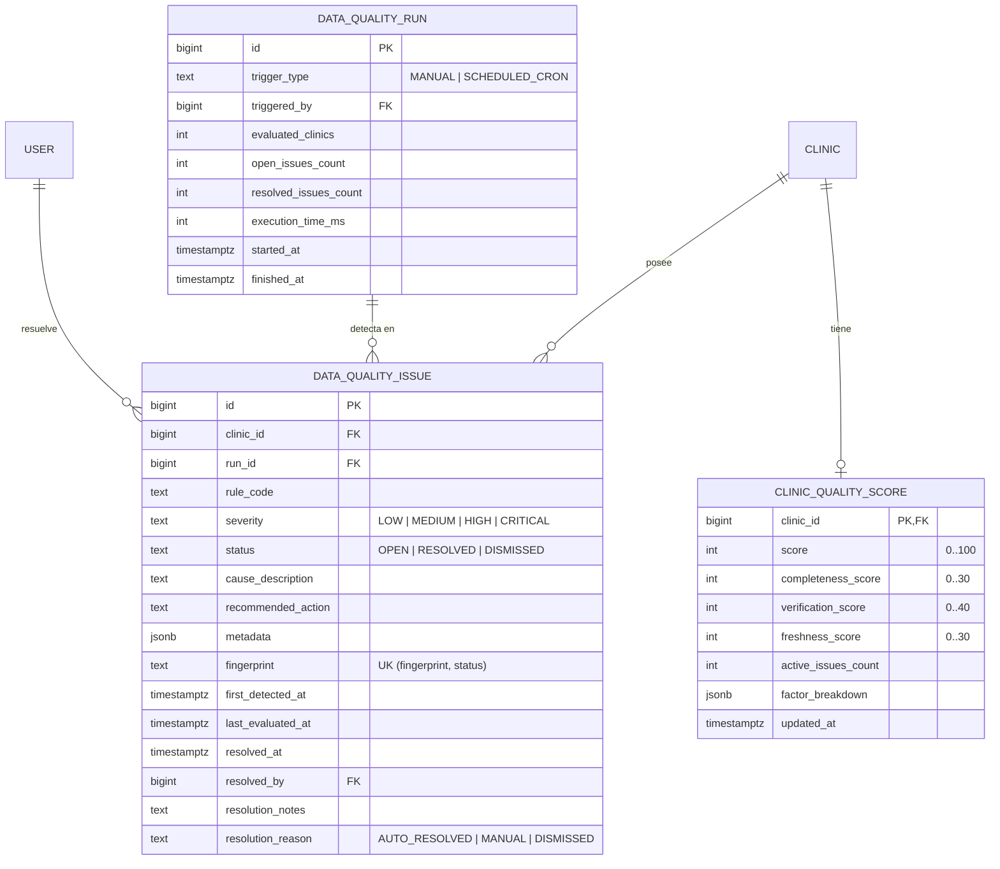
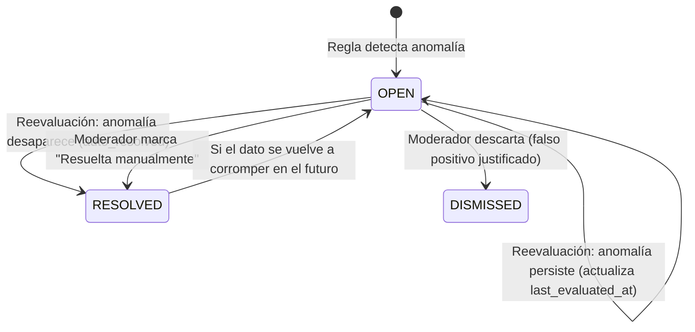

# Especificación Técnica: Motor de Calidad y Confiabilidad de Datos
**Proyecto:** VetBiobío — Directorio Geográfico de Clínicas Veterinarias de la Región del Biobío  
**Módulo:** `DataQualityModule` (Fase 2)  
**Documento:** `/docs/specs/data-quality.md`  
**Estado:** Propuesto — Pendiente de Aprobación  
**Fecha:** Octubre 2026  
**Autor:** Antigravity (Pair Programming / Arquitectura & Calidad)  

---

## 1. Contexto y Objetivos

### 1.1 Diagnóstico de Partida
El proyecto opera actualmente con un conjunto piloto de 16 clínicas reales en el Gran Concepción:
- **1 clínica verificada** (`clinica-veterinaria-concepcion`) corroborada mediante sitio web oficial y contacto directo.
- **15 clínicas pendientes de verificación telefónica** (`PENDING_REVIEW`).
- Cobertura incompleta de precios en varias fichas y vigencias no corroboradas en los últimos 6 meses.
- Páginas legales e informativas en estado de borrador técnico.

### 1.2 Propósito del Motor de Calidad
Transformar la auditoría de datos de un proceso manual esporádico a un **sistema continuo, determinista y automatizado** que:
1. Detecte anomalías, inconsistencias de formato, traslapes de horarios y desactualizaciones en cada ficha clínica.
2. Genere **incidencias idempotentes** con causa raíz y acción correctiva clara para moderadores.
3. Calcule un **Puntaje de Confiabilidad (0 a 100)** que explique sus factores matemáticos a usuarios y revisores.
4. Cierre automáticamente incidencias cuando el dato en producción sea corregido (*auto-healing audit*).
5. Permita ejecuciones bajo demanda (manuales) y programadas (cron diario), registrando métricas históricas de salud de datos.

### 1.3 Delimitación Legal y de Producto (Disclaimer Obligatorio)
> **Aviso de Responsabilidad y Política de Producto:**  
> En todas las pantallas públicas y administrativas, el indicador de confiabilidad debe ir acompañado obligatoriamente del siguiente texto:  
> *"El Puntaje de Confiabilidad de VetBiobío refleja exclusivamente la frescura, integridad y corroboración documental de los datos de contacto y horarios publicados en la plataforma. No constituye una certificación sanitaria ni avala la calidad médica de los servicios veterinarios."*

---

## 2. Modelo de Datos (Esquema PostgreSQL + Prisma)

Se implementará una migración reversible `0010_data_quality` conteniendo tres entidades principales:



### 2.1 Definición SQL de la Migración (`0010_data_quality/migration.sql`)
```sql
DO $$ BEGIN
  CREATE TYPE data_quality_severity AS ENUM ('LOW', 'MEDIUM', 'HIGH', 'CRITICAL');
  CREATE TYPE data_quality_status AS ENUM ('OPEN', 'RESOLVED', 'DISMISSED');
  CREATE TYPE data_quality_trigger AS ENUM ('MANUAL', 'SCHEDULED_CRON');
EXCEPTION WHEN duplicate_object THEN NULL; END $$;

-- 1. Historial de ejecuciones del motor
CREATE TABLE IF NOT EXISTS data_quality_run (
  id BIGINT GENERATED ALWAYS AS IDENTITY PRIMARY KEY,
  trigger_type data_quality_trigger NOT NULL,
  triggered_by BIGINT REFERENCES "user"(id) ON DELETE SET NULL,
  evaluated_clinics INT NOT NULL DEFAULT 0,
  open_issues_count INT NOT NULL DEFAULT 0,
  resolved_issues_count INT NOT NULL DEFAULT 0,
  execution_time_ms INT NOT NULL DEFAULT 0,
  started_at TIMESTAMPTZ NOT NULL DEFAULT now(),
  finished_at TIMESTAMPTZ
);
CREATE INDEX IF NOT EXISTS dq_run_started_idx ON data_quality_run(started_at DESC);

-- 2. Incidencias individuales de calidad
CREATE TABLE IF NOT EXISTS data_quality_issue (
  id BIGINT GENERATED ALWAYS AS IDENTITY PRIMARY KEY,
  clinic_id BIGINT NOT NULL REFERENCES clinic(id) ON DELETE CASCADE,
  run_id BIGINT REFERENCES data_quality_run(id) ON DELETE SET NULL,
  rule_code TEXT NOT NULL,
  severity data_quality_severity NOT NULL,
  status data_quality_status NOT NULL DEFAULT 'OPEN',
  cause_description TEXT NOT NULL,
  recommended_action TEXT NOT NULL,
  metadata JSONB NOT NULL DEFAULT '{}'::jsonb,
  fingerprint TEXT NOT NULL, -- sha256(clinic_id + rule_code + target_id)
  first_detected_at TIMESTAMPTZ NOT NULL DEFAULT now(),
  last_evaluated_at TIMESTAMPTZ NOT NULL DEFAULT now(),
  resolved_at TIMESTAMPTZ,
  resolved_by BIGINT REFERENCES "user"(id) ON DELETE SET NULL,
  resolution_notes TEXT,
  resolution_reason TEXT, -- 'AUTO_RESOLVED', 'MANUALLY_RESOLVED', 'FALSE_POSITIVE'
  created_at TIMESTAMPTZ NOT NULL DEFAULT now(),
  updated_at TIMESTAMPTZ NOT NULL DEFAULT now(),
  CONSTRAINT unique_open_issue_fingerprint UNIQUE (fingerprint, status)
);
CREATE INDEX IF NOT EXISTS dq_issue_clinic_status_idx ON data_quality_issue(clinic_id, status);
CREATE INDEX IF NOT EXISTS dq_issue_severity_idx ON data_quality_issue(severity, status);

-- 3. Puntaje calculado por clínica
CREATE TABLE IF NOT EXISTS clinic_quality_score (
  clinic_id BIGINT PRIMARY KEY REFERENCES clinic(id) ON DELETE CASCADE,
  score INT NOT NULL CHECK (score BETWEEN 0 AND 100),
  completeness_score INT NOT NULL CHECK (completeness_score BETWEEN 0 AND 30),
  verification_score INT NOT NULL CHECK (verification_score BETWEEN 0 AND 40),
  freshness_score INT NOT NULL CHECK (freshness_score BETWEEN 0 AND 30),
  active_issues_count INT NOT NULL DEFAULT 0,
  factor_breakdown JSONB NOT NULL DEFAULT '{}'::jsonb,
  updated_at TIMESTAMPTZ NOT NULL DEFAULT now()
);
```

---

## 3. Catálogo de Reglas Configurables

Las reglas se implementan como unidades desacopladas, inmutables y puras bajo el contrato `QualityRule`. Cada regla define sus umbrales y severidad como **datos de configuración**, permitiendo parametrización sin dispersar lógica por la base de código.

```typescript
export interface RuleEvaluationContext {
  clinic: any;
  location?: any;
  schedules: any[];
  services: any[];
  prices: any[];
  allClinicsPhones: Array<{ clinicId: bigint; phoneE164: string; clinicName: string }>;
}

export interface RuleViolation {
  ruleCode: string;
  severity: 'LOW' | 'MEDIUM' | 'HIGH' | 'CRITICAL';
  causeDescription: string;
  recommendedAction: string;
  metadata?: Record<string, any>;
  targetEntityId?: string | number; // Identificador opcional para diferenciar items (ej. horario o precio)
}

export interface QualityRule {
  readonly code: string;
  readonly name: string;
  readonly defaultSeverity: 'LOW' | 'MEDIUM' | 'HIGH' | 'CRITICAL';
  evaluate(ctx: RuleEvaluationContext): RuleViolation[];
}
```

### 3.1 Especificación de las 7 Reglas Obligatorias

| Código | Nombre | Severidad | Condición de Activación | Acción Recomendada |
|---|---|---|---|---|
| **RULE_INVALID_PHONE** | Teléfono con Formato Inválido | `CRITICAL` | `phone_e164` no cumple estándar E.164 chileno válido (+569XXXXXXXX o +5641XXXXXXX) verificado con `libphonenumber-js`. | Corregir o normalizar número telefónico a formato internacional +56. |
| **RULE_SUSPICIOUS_GEO** | Coordenadas Sospechosas / Fuera de Región | `CRITICAL` | Coordenadas de `clinic_location` fuera del BBOX del Biobío (Lat: [-38.5, -36.0], Lon: [-74.5, -71.0]) o en polígono de agua marina según PostGIS. | Re-geocodificar dirección física con precisión catastral o satelital. |
| **RULE_SCHEDULE_CONFLICT** | Horario Inconsistente o en Conflicto | `HIGH` | Mismo día de la semana con traslapes horarios, `opening_time >= closing_time` sin flag `is_overnight`, o día sin horas sin marcar `is_closed`. | Ajustar matriz de horarios de la clínica para eliminar colisiones. |
| **RULE_EXPIRED_PRICES** | Aranceles Desactualizados | `HIGH` | Precios vigentes (`valid_until IS NULL`) cuya fecha `valid_from` o última verificación supere 365 días. | Contactar al establecimiento para solicitar tarifario vigente. |
| **RULE_OUTDATED_VERIFICATION** | Verificación Caducada | `HIGH` | Entidad con estado `VERIFIED` pero con fecha `next_review_at < CURRENT_DATE` o sin reverificar en los últimos 180 días. | Realizar llamada telefónica de re-validación de ficha. |
| **RULE_DUPLICATE_PHONE** | Teléfono Duplicado en Otra Clínica | `HIGH` | El mismo `phone_e164` o `whatsapp_e164` está asignado a otra clínica distinta con diferente slug. | Verificar si corresponde a una misma cadena/sucursal o error de tipeo. |
| **RULE_INCOMPLETE_FIELDS** | Perfil Incompleto de Información Básica | `MEDIUM` | Ficha sin dirección física, sin horario para días laborales, o sin ningún servicio/examen asociado. | Completar datos faltantes desde sitio web oficial o redes sociales. |

---

## 4. Ciclo de Vida de las Incidencias e Idempotencia

### 4.1 Huella de Incidencia (Fingerprint)
Para asegurar que las reevaluaciones sean **estrictamente idempotentes**, cada hallazgo genera una clave unívoca SHA-256:
```
fingerprint = sha256(`${clinic_id}:${rule_code}:${targetEntityId || 'root'}`)
```

### 4.2 Máquina de Estados y Auto-Resolución (*Auto-Healing*)


1. **Detección Inicial:** Se inserta la fila con `status = 'OPEN'`, `first_detected_at = now()`.
2. **Reevaluación Sin Cambios:** Si la regla vuelve a fallar con el mismo fingerprint, no se duplica la incidencia; se ejecuta `UPDATE data_quality_issue SET last_evaluated_at = now() WHERE fingerprint = $1 AND status = 'OPEN'`.
3. **Resolución Automática:** Si en una corrida posterior la regla **ya no detecta la infracción** (el dato fue arreglado), el motor ejecuta:
   ```sql
   UPDATE data_quality_issue 
   SET status = 'RESOLVED', resolved_at = now(), resolution_reason = 'AUTO_RESOLVED', 
       resolution_notes = 'Anomalía corregida automáticamente tras reevaluación'
   WHERE clinic_id = $1 AND fingerprint NOT IN (...) AND status = 'OPEN';
   ```
4. **Descarte Manual:** Un administrador puede pasar la incidencia a `DISMISSED` registrando notas obligatorias (ej. "La clínica comparte teléfono con centro matriz por convenio").

---

## 5. Algoritmo de Puntaje de Confiabilidad Explicable

El puntaje global (0 a 100) es determinista, reproducible y auditable. Se compone de tres pilares más una penalización por incidencias críticas:

$$\text{Puntaje} = \max\Big(0, \min\big(100, \text{Completitud} + \text{Verificación} + \text{Frescura} - \text{Penalización}\big)\Big)$$

### 5.1 Desglose de Factores

1. **Completitud de Ficha (0 a 30 puntos):**
   * Nombre, descripción y slug válido: +6 pts.
   * Dirección física normalizada y coordenadas PostGIS: +8 pts.
   * Teléfono de contacto E.164 verificado: +6 pts.
   * Matriz de horarios completa (lunes a viernes mínimo): +5 pts.
   * Al menos 3 servicios/exámenes asociados: +5 pts.
2. **Nivel de Verificación Humana (0 a 40 puntos):**
   * Ficha global con estado `VERIFIED`: +20 pts (`PENDING_REVIEW`: +10 pts, `UNVERIFIED`: 0 pts).
   * Verificación respaldada por fuente oficial (`OFFICIAL_WEBSITE`, `DIRECT_COMMUNICATION` o `PHONE`): +10 pts.
   * Horarios o precios verificados con fuente y fecha: +10 pts.
3. **Frescura y Actualización Temporal (0 a 30 puntos):**
   * Verificación o actualización realizada en los últimos 90 días: +30 pts.
   * Actualizada entre 91 y 180 días: +20 pts.
   * Actualizada entre 181 y 365 días: +10 pts.
   * Más de 365 días sin contacto ni actualización: 0 pts.
4. **Penalización por Incidencias Activas:**
   * Cada incidencia `CRITICAL` abierta (`RULE_INVALID_PHONE`, `RULE_SUSPICIOUS_GEO`): **-25 pts**.
   * Cada incidencia `HIGH` abierta (`RULE_SCHEDULE_CONFLICT`, `RULE_EXPIRED_PRICES`): **-10 pts**.

---

## 6. API REST y Contratos de Entrada/Salida

Todos los endpoints administrativos requieren `@UseGuards(JwtAuthGuard, RolesGuard)` y rol `@Roles('ADMIN', 'EDITOR')`.

### 6.1 Endpoints Administrativos
* `POST /api/v1/admin/data-quality/run`
  * Body: `{ clinicId?: string }` (Opcional: evalúa una clínica individual o toda la base).
  * Retorna: `{ runId: string, evaluatedClinics: number, openIssues: number, resolvedIssues: number, durationMs: number }`.
* `GET /api/v1/admin/data-quality/runs`
  * Query params: `page`, `limit`.
  * Retorna lista paginada de ejecuciones históricas y estadísticas de evolución.
* `GET /api/v1/admin/data-quality/issues`
  * Query params: `status`, `severity`, `ruleCode`, `commune`, `clinicId`, `page`, `limit`.
  * Retorna lista de incidencias filtradas con datos de la clínica y causa recomendada.
* `PATCH /api/v1/admin/data-quality/issues/:id`
  * Body: `{ status: 'RESOLVED' | 'DISMISSED', resolutionNotes: string }`.
  * Actualiza la incidencia y registra auditoría en `audit_log`.
* `GET /api/v1/admin/data-quality/overview`
  * Retorna KPIs globales: salud regional (% clínicas con score >= 70), total incidencias abiertas por severidad, desglose por regla.

### 6.2 Endpoint Público de Confiabilidad
* `GET /api/v1/clinics/:slug/reliability`
  * Acceso público sin autenticación.
  * Respuesta:
    ```json
    {
      "score": 75,
      "tier": "ALTA",
      "breakdown": {
        "completeness": { "points": 25, "max": 30, "detail": "Datos de contacto, dirección y servicios completos" },
        "verification": { "points": 30, "max": 40, "detail": "Ficha y ubicación verificadas vía sitio web oficial" },
        "freshness": { "points": 20, "max": 30, "detail": "Verificación confirmada hace 4 meses" }
      },
      "activeIssuesCount": 0,
      "disclaimer": "El Puntaje de Confiabilidad de VetBiobío refleja exclusivamente la frescura, integridad y corroboración documental de los datos de contacto y horarios publicados en la plataforma. No constituye una certificación sanitaria ni avala la calidad médica de los servicios veterinarios."
    }
    ```

---

## 7. Diseño de Pantallas y Experiencia de Usuario

### 7.1 Panel Administrativo (`/admin/calidad`)
1. **Header y Acciones:** Contadores de salud del directorio, score promedio regional (ej. `68/100`), fecha de última corrida y botón principal *"Ejecutar Auditoría Ahora"*.
2. **Matriz de Incidencias:** Tabla con filtros rápidos por severidad (Crítica, Alta, Media), comuna y regla. Cada fila muestra:
   * Badge de severidad con código cromático (Rojo: Crítica, Ámbar: Alta, Azul: Media).
   * Nombre de clínica y comuna.
   * Causa resumida (ej. *"Teléfono sin formato E.164: +56412345"*).
   * Acción recomendada.
   * Botón *"Detalle y Resolver"*.
3. **Modal de Detalle de Incidencia:** Muestra los metadatos JSON formateados, historial de detección, enlace directo para editar la ficha de la clínica y formulario para descartar/resolver con nota obligatoria.

### 7.2 Ficha Pública de Clínica (`/veterinarias/[commune]/[slug]`)
1. **Insignia de Confiabilidad:** Ubicada junto al nombre de la clínica (ej. *"Confiabilidad: 75/100 · Datos Corroborados"*).
2. **Modal Explicativo al Clic:**
   * Desglose visual por barras (Completitud, Verificación, Frescura).
   * Lista de fuentes confirmadas (ej. *"Verificado por llamada telefónica en Septiembre 2026"*).
   * Cuadro visible y destacado con el disclaimer de no certificación sanitaria.

---

## 8. Estrategia de Pruebas Automatizadas

1. **Pruebas Unitarias de Reglas (`data-quality/rules/*.spec.ts`):**
   * `rule-invalid-phone.spec.ts`: Prueba números correctos chilenos (+56912345678, +5641223344), números sin prefijo, números de otros países y números malformados.
   * `rule-suspicious-geo.spec.ts`: Coordenadas en Concepción (OK), coordenadas en Santiago o fuera de Chile (Violación), coordenadas en el mar (Violación).
   * `rule-schedule-conflict.spec.ts`: Horarios coincidentes, apertura posterior al cierre, 24h, overnight coherente vs incoherente.
   * `rule-expired-prices.spec.ts`: Precios con vigencia reciente vs precios de más de 365 días.
2. **Pruebas de Integración e Idempotencia (`data-quality/incident.service.spec.ts`):**
   * Primera corrida con anomalía crea incidencia `OPEN`.
   * Segunda corrida idéntica no duplica la incidencia; actualiza `last_evaluated_at`.
   * Tercera corrida con el dato corregido pasa la incidencia previa automáticamente a `RESOLVED` con razón `AUTO_RESOLVED`.
3. **Pruebas de Control de Acceso (`data-quality.controller.spec.ts`):**
   * Peticiones anónimas a `/admin/data-quality/*` retornan 401 Unauthorized.
   * Peticiones con rol no administrativo retornan 403 Forbidden.

---
*Fin de la Especificación Técnica — /docs/specs/data-quality.md.*
