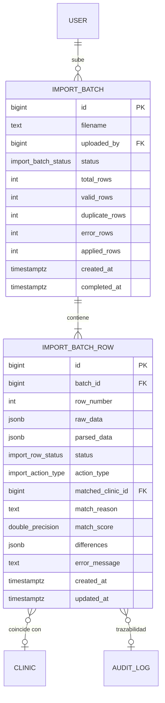

# Especificación Técnica — Ingesta Avanzada con Staging, Deduplicación Multicriterio y Dry-Run

> **Documento:** `/docs/specs/import.md`  
> **Fase del Proyecto:** Fase 3 (Ingesta y Automatización Resiliente)  
> **ADR de Referencia:** [`ADR-007`](file:///c:/Users/luis_/OneDrive/Documentos/VetBioBio/docs/decisions/ADR-007-postgresql-queue.md) (Procesamiento Asíncrono en PostgreSQL con SKIP LOCKED)  
> **Estado:** Propuesto para Revisión y Aprobación  

---

## 1. Visión y Objetivos

El sistema de ingesta actual (`scripts/import-csv.ts`) es un script piloto sincrónico que realiza geocodificación secuencial e inserciones directas sin staging ni detección sistemática de colisiones.

La **Fase 3** eleva la plataforma a un estándar de ingeniería de producción resolviendo 4 desafíos críticos:
1. **Separación Estricta de Staging y Producción:** Los datos crutos se cargan en tablas transitorias (`import_batch` e `import_batch_row`). Ninguna mutación toca las tablas principales (`clinic`, `clinic_location`, `schedule`, `prices`) sin validación previa.
2. **Deduplicador Multicriterio PostGIS + Trigramas + E.164:** Análisis híbrido para detectar si una clínica entrante ya existe en la base de datos por teléfono, nombre similar o proximidad geográfica (<100m).
3. **Flujo de Previsualización Dry-Run:** El administrador inspecciona las diferencias exactas (`INSERT`, `UPDATE`, `POSSIBLE_DUPLICATE`, `INVALID`) antes de aplicar cambios.
4. **Worker Asíncrono no bloqueante en PostgreSQL (`SKIP LOCKED`):** Procesamiento en segundo plano sin dependencias externas pesadas (sin Redis), tolerante a reinicios y con control de concurrencia nativo.

---

## 2. Modelo de Datos y Esquema Relacional



### 2.1 Enums y Estructuras en PostgreSQL (Migración `0011_import_pipeline`)

```sql
DO $$ BEGIN
  CREATE TYPE import_batch_status AS ENUM (
    'PENDING_ANALYSIS', -- Recibido, esperando procesamiento del worker
    'ANALYZING',        -- Worker analizando filas y duplicados
    'ANALYZED',         -- Análisis completo listo para revisión humana (Dry-Run)
    'APPLYING',         -- Transfiriendo filas validadas a producción
    'COMPLETED',        -- Finalizado exitosamente
    'FAILED',           -- Fallo global irrecuperable
    'CANCELLED'         -- Descartado por el moderador
  );
  CREATE TYPE import_row_status AS ENUM (
    'PENDING',            -- No procesada por el worker
    'VALID',              -- Datos limpios sin conflictos (nueva clínica)
    'POSSIBLE_DUPLICATE', -- Coincidencia detectada con clínica existente
    'INVALID',            -- Error sintáctico o fuera de región
    'APPLIED',            -- Insertada/actualizada en producción
    'REJECTED',           -- Descartada por el moderador
    'ERROR'               -- Error durante la aplicación a producción
  );
  CREATE TYPE import_action_type AS ENUM (
    'INSERT',    -- Crear nueva clínica
    'UPDATE',    -- Actualizar clínica existente
    'SKIP'       -- Omitir sin cambios
  );
EXCEPTION WHEN duplicate_object THEN NULL; END $$;

-- 1. Tabla de Lotes
CREATE TABLE IF NOT EXISTS import_batch (
  id BIGINT GENERATED ALWAYS AS IDENTITY PRIMARY KEY,
  filename TEXT NOT NULL,
  uploaded_by BIGINT REFERENCES "user"(id) ON DELETE SET NULL,
  status import_batch_status NOT NULL DEFAULT 'PENDING_ANALYSIS',
  total_rows INT NOT NULL DEFAULT 0,
  valid_rows INT NOT NULL DEFAULT 0,
  duplicate_rows INT NOT NULL DEFAULT 0,
  error_rows INT NOT NULL DEFAULT 0,
  applied_rows INT NOT NULL DEFAULT 0,
  created_at TIMESTAMPTZ NOT NULL DEFAULT now(),
  updated_at TIMESTAMPTZ NOT NULL DEFAULT now(),
  completed_at TIMESTAMPTZ
);
CREATE INDEX IF NOT EXISTS import_batch_status_idx ON import_batch(status, created_at DESC);

-- 2. Tabla de Filas de Staging
CREATE TABLE IF NOT EXISTS import_batch_row (
  id BIGINT GENERATED ALWAYS AS IDENTITY PRIMARY KEY,
  batch_id BIGINT NOT NULL REFERENCES import_batch(id) ON DELETE CASCADE,
  row_number INT NOT NULL,
  raw_data JSONB NOT NULL,
  parsed_data JSONB,
  status import_row_status NOT NULL DEFAULT 'PENDING',
  action_type import_action_type NOT NULL DEFAULT 'INSERT',
  matched_clinic_id BIGINT REFERENCES clinic(id) ON DELETE SET NULL,
  match_reason TEXT,
  match_score DOUBLE PRECISION,
  differences JSONB NOT NULL DEFAULT '{}'::jsonb,
  error_message TEXT,
  created_at TIMESTAMPTZ NOT NULL DEFAULT now(),
  updated_at TIMESTAMPTZ NOT NULL DEFAULT now(),
  CONSTRAINT unique_batch_row_number UNIQUE (batch_id, row_number)
);
CREATE INDEX IF NOT EXISTS import_row_worker_idx ON import_batch_row(batch_id, status);
CREATE INDEX IF NOT EXISTS import_row_matched_clinic_idx ON import_batch_row(matched_clinic_id);
```

---

## 3. Deduplicador Multicriterio (Deduplication Pipeline)

Para prevenir la duplicación de fichas clínicas y detectar oportunidades de actualización automática, cada fila se evalúa contra tres dimensiones independientes:

| Criterio | Mecanismo SQL / Algoritmo | Peso | Condición de Activación |
|---|---|---|---|
| **1. Teléfono E.164 (Fuerte)** | Igualdad exacta contra `clinic.phone_e164` o `whatsapp_e164`. | **50%** | Número normalizado coincide con otra clínica. |
| **2. Similitud Fonética / Trigramas** | Operador `similarity(name, $1)` vía extensión `pg_trgm`. | **30%** | `similarity >= 0.65` (ej. "Vet Concepción" vs "Clínica Veterinaria Concepción"). |
| **3. Proximidad Espacial PostGIS** | `ST_DWithin(location, ST_MakePoint(lng, lat)::geography, 100)` | **20%** | Coordenadas a menos de 100 metros de una clínica existente en la misma comuna. |

### 3.1 Puntuación Compuesta de Coincidencia

$$\text{MatchScore} = (0.50 \times \text{PhoneScore}) + (0.30 \times \text{TrigramScore}) + (0.20 \times \text{GeoScore})$$

* **$\text{MatchScore} \ge 0.70$:** Clasificada como `POSSIBLE_DUPLICATE` (acción sugerida: `UPDATE` de la clínica existente).
* **$\text{MatchScore} < 0.30$:** Clasificada como `VALID` (acción sugerida: `INSERT` como nueva clínica).
* **$0.30 \le \text{MatchScore} < 0.70$:** Clasificada como `POSSIBLE_DUPLICATE` con advertencia de revisión manual (colisión potencial de nombre o ubicación).

### 3.2 Detección de Diferencias (Diff Computation)

Cuando se detecta una coincidencia con una clínica existente, el motor calcula el objeto `differences`:
```json
{
  "name": { "current": "Clínica Vet San Pedro", "proposed": "Clínica Veterinaria San Pedro SpA" },
  "phoneE164": { "current": "+5641223344", "proposed": "+56912345678" },
  "address": { "current": "Pedro Aguirre Cerda 120", "proposed": "Av. Pedro Aguirre Cerda 124" },
  "website": { "current": null, "proposed": "https://vetsanpedro.cl" }
}
```

---

## 4. Arquitectura del Worker Asíncrono (PostgreSQL SKIP LOCKED)

En lugar de delegar el trabajo a Redis o bloquear la conexión HTTP:
1. El usuario sube el archivo a `POST /admin/import/upload`.
2. El servidor parsea el CSV/JSON a streaming, inserta el lote en `import_batch` y las filas en bruto en `import_batch_row` dentro de una transacción.
3. Responde inmediatamente con `202 Accepted` y el objeto `{ batchId: "123", totalRows: 50 }`.
4. El worker toma lotes de filas pendientes usando bloqueo sin contención:
   ```sql
   SELECT id, batch_id, raw_data 
   FROM import_batch_row
   WHERE batch_id = $1 AND status = 'PENDING'
   ORDER BY id ASC
   LIMIT 20
   FOR UPDATE SKIP LOCKED;
   ```
5. Valida el formato chileno E.164, comuna CUT, coordenadas dentro del BBOX del Biobío, ejecuta la deduplicación y actualiza el estado de cada fila.
6. Al finalizar todas las filas del lote, el estado del lote pasa automáticamente a `ANALYZED`.

---

## 5. Aplicación Transaccional y Auditoría

La aplicación de cambios es un proceso explícito y seguro:
1. El administrador entra a `/admin/importar/[batchId]`, visualiza el resumen (ej. 30 nuevas, 5 actualizaciones, 2 duplicados, 1 error sintáctico).
2. Puede ajustar la acción de cada fila (`INSERT`, `UPDATE`, `SKIP`).
3. Al presionar *"Aplicar a Producción"*, se envía `POST /admin/import/batches/:id/apply`.
4. La API procesa las filas confirmadas dentro de bloques `$transaction`:
   - Para `INSERT`: crea la clínica, la ubicación geográfica PostGIS (`ST_SetSRID`), y registra en `audit_log` con acción `CREATE`, `entityType: 'clinic'`, `newValues: { source: 'import_batch_#123' }`.
   - Para `UPDATE`: actualiza los campos modificados y registra en `audit_log` con acción `UPDATE` y traza antes/después.
   - Si una fila falla en la aplicación, se marca como `ERROR` sin abortar las demás filas del lote (resiliencia por fila).
5. Se dispara automáticamente la reevaluación del **Motor de Calidad de Datos (Fase 2)** para las clínicas afectadas, garantizando que sus puntajes de confiabilidad e incidencias queden sincronizados al instante.

---

## 6. API REST y Contratos

Todos los endpoints administrativos requieren `@UseGuards(JwtAuthGuard, RolesGuard)` y rol `@Roles('ADMIN', 'EDITOR')`.

* `POST /api/v1/admin/import/upload` (Multipart CSV o JSON)
  - Retorna `{ batchId: string, filename: string, totalRows: number, status: 'PENDING_ANALYSIS' }`.
* `GET /api/v1/admin/import/batches`
  - Retorna lista paginada de lotes históricos con métricas de avance.
* `GET /api/v1/admin/import/batches/:id`
  - Retorna detalle del lote, métricas de filas (`valid`, `duplicate`, `error`, `applied`).
* `GET /api/v1/admin/import/batches/:id/rows`
  - Query params: `status`, `actionType`, `page`, `limit`.
  - Retorna filas analizadas con `differences`, `matchedClinic` y causas de detección.
* `PATCH /api/v1/admin/import/batches/:id/rows/:rowId`
  - Body: `{ actionType: 'INSERT' | 'UPDATE' | 'SKIP' }`.
  - Permite al moderador anular la sugerencia automática del deduplicador.
* `POST /api/v1/admin/import/batches/:id/apply`
  - Body: `{ applyDuplicatesAsNew?: boolean }`.
  - Transfiere transaccionalmente las filas aprobadas a producción.
* `POST /api/v1/admin/import/batches/:id/cancel`
  - Marca el lote como `CANCELLED`.

---

## 7. Pantalla Administrativa de Ingesta (`/admin/importar`)

1. **Zona de Carga:** Drag & drop de archivos CSV/JSON con pre-validación de columnas requeridas (`name`, `address`, `communeCut`, `phone`, `website`, `lat`, `lng`).
2. **Historial de Lotes:** Tarjetas de lotes con barra de progreso, badges de estado y fecha.
3. **Visor de Dry-Run:**
   - Filtros rápidos por estado de fila: *Nuevas (Verde)*, *Actualizaciones (Azul)*, *Posibles Duplicados (Ámbar)*, *Inválidas (Rojo)*.
   - Vista de diferencias (*Diff Viewer*) en formato visual comparativo (campo por campo).
   - Acciones individuales por fila (cambiar acción sugerida).
4. **Botón Principal de Aplicación:** Muestra advertencia clara del impacto en producción (ej. *"Se crearán 28 clínicas nuevas y se actualizarán 4 existentes"*).

---

## 8. Estrategia de Pruebas Automatizadas

1. **Pruebas Unitarias del Parser y Normalizador (`import-parser.spec.ts`):**
   - Parsing de CSV con comillas, saltos de línea y codificación UTF-8 / latin1.
   - Normalización de números telefónicos chilenos y comunas CUT del Biobío.
2. **Pruebas Unitarias del Deduplicador (`deduplication.service.spec.ts`):**
   - Coincidencia exacta de teléfono -> Score 1.0.
   - Coincidencia de nombre por trigramas -> Score proporcional.
   - Coincidencia espacial por PostGIS -> Score proporcional.
   - Detección de casos sin coincidencia -> Score 0.0.
3. **Pruebas de Concurrencia del Worker (`import-worker.spec.ts`):**
   - `SKIP LOCKED`: Verificación de que dos workers concurrentes procesando el mismo lote no toman las mismas filas.
4. **Pruebas de Integración Transaccional (`import-apply.spec.ts`):**
   - Verificación de que las filas `APPLIED` generan registros en `clinic`, `clinic_location` y `audit_log`.
   - Idempotencia: cancelar o re-analizar no corrompe registros existentes.

---
*Fin de la Especificación Técnica — /docs/specs/import.md*
