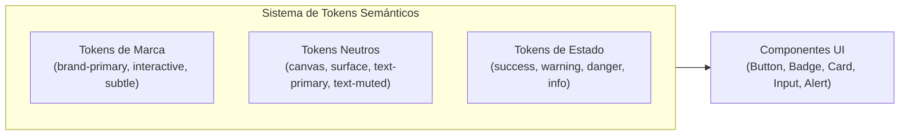

# Sistema de Diseño y Tokens — VetBiobío Frontend

> **Documento:** `/docs/ui/01-sistema-de-diseno.md`  
> **Fase:** 1 — Sistema de Diseño (Propuesta)  
> **Fecha:** 2026-10-09  
> **Rama:** `fase-1-sistema-diseno`  
> **Norma de referencia:** WCAG 2.2 Nivel AA + Criterios de Portafolio y Mobile-First

---

## 1. Dirección Visual

Para dotar a VetBiobío de una identidad sólida, profesional y defendible ante evaluadores técnicos, se analizaron dos posibles direcciones de producto:

### Opción A: "Clínico Institucional"
* **Enfoque:** Paleta dominada por azules fríos, fondos blancos puros, tipografía geométrica neutra y esquinas rectas o mínimamente redondeadas.
* **Ventajas:** Máxima sobriedad, similar a portales hospitalarios o gubernamentales (MINSAL / SAG).
* **Desventajas:** Puede percibirse frío, distante o burocrático para dueños de mascotas que buscan atención médica con urgencia o angustia.

### Opción B: "Cálido y Confiable" (Clínico Cercano) — **RECOMENDADA**
* **Enfoque:** Combina la rigurosidad y serenidad de un verde azulado profundo (*Teal sanitario / Bosque del Biobío*) con la calidez de neutros ligeramente templados (*warm paper / slate*), esquinas con curvatura equilibrada (8px a 12px) y tipografía humanista con excelente lectura de números tabulares en CLP.
* **Justificación de la recomendación:** VetBiobío es un puente comunitario entre familias y clínicas de salud animal. La interfaz debe transmitir **autoridad técnica y tranquilidad**, reduciendo la fricción cognitiva en situaciones de emergencia médica sin caer en la frialdad hospitalaria ni en el aspecto infantil de una tienda de mascotas.

---

## 2. Paleta de Color y Tokens Semánticos

Los colores se estructuran bajo **tokens semánticos por función**, eliminando referencias a nombres de tonalidad arbitrarios (`emerald`, `slate`, `rose`):



### 2.1. Tokens de Marca
| Token Semántico | Valor HEX | Uso en Interfaz |
|---|---|---|
| `color-brand-primary` | `#146354` | Títulos principales, elementos de identidad y contraste alto |
| `color-brand-interactive` | `#177c67` | Botones primarios, enlaces activos, elementos de acción |
| `color-brand-hover` | `#105446` | Estado hover de acciones primarias interactivas |
| `color-brand-subtle` | `#effaf7` | Fondos de tarjetas destacadas y banners de marca |
| `color-brand-border` | `#a3dfcf` | Bordes sutiles de contenedores de marca |

### 2.2. Tokens Neutros (Superficie y Texto)
| Token Semántico | Valor HEX | Uso en Interfaz |
|---|---|---|
| `color-bg-canvas` | `#f8faf9` | Fondo general de la página (evita el blanco puro deslumbrante) |
| `color-bg-surface` | `#ffffff` | Fondo de tarjetas (`Card`), modales, dropdowns y barra superior |
| `color-bg-surface-alt` | `#f0f4f2` | Encabezados de tabla, fondos de inputs inactivos |
| `color-border-subtle` | `#e1e7e4` | Líneas divisorias de secciones y bordes de tarjeta |
| `color-border-default` | `#cbd5d1` | Bordes de inputs, selects y botones secundarios |
| `color-border-focus` | `#146354` | Anillo de foco accesible para teclado (ratio 6.31:1) |
| `color-text-primary` | `#122335` | Texto principal de párrafos, títulos e inputs (ratio 14.83:1) |
| `color-text-secondary` | `#33475b` | Subtítulos, etiquetas de formulario y descripciones (ratio 8.24:1) |
| `color-text-muted` | `#4a6177` | Metadatos, fechas de actualización y textos de apoyo (ratio 5.61:1) |

### 2.3. Estados de Verificación (Doble Codificación: Color + Ícono + Texto)
Para cumplir con la directriz de **no transmitir información exclusivamente por color** y garantizar legibilidad para usuarios con daltonismo (protanopía, deuteranopía, tritanopía):

| Estado | Token Texto | Token Fondo | Token Borde | Ícono | Texto Obligatorio |
|---|---|---|---|:---:|---|
| **VERIFIED** | `#135045` | `#effaf7` | `#a3dfcf` | `✓` | *Verificada [Fecha]* |
| **PENDING_REVIEW** | `#7c2d12` | `#fef3c7` | `#fcd34d` | `◷` | *En revisión telefónica* |
| **OUTDATED** | `#7c2d12` | `#ffedd5` | `#fdba74` | `⚠` | *Posiblemente desactualizada* |
| **UNVERIFIED** | `#1e3a8a` | `#eff6ff` | `#bfdbfe` | `ⓘ` | *Sin verificar* |
| **REJECTED** | `#881337` | `#ffe4e6` | `#fda4af` | `✕` | *Rechazada / Inexacta* |

### 2.4. Tabla de Contrastes Calculada (Norma WCAG 2.2 AA)
Fórmula de luminancia relativa estándar W3C ($L_1 + 0.05) / (L_2 + 0.05)$:

| Elemento / Par de Color | Texto | Fondo | Ratio Calculado | Nivel WCAG |
|---|---|---|:---:|:---:|
| **Texto Primario / Superficie** | `#122335` | `#ffffff` | **14.83:1** | AAA (≥ 7.0:1) |
| **Texto Secundario / Superficie** | `#33475b` | `#ffffff` | **8.24:1** | AAA (≥ 7.0:1) |
| **Texto Muted / Superficie** | `#4a6177` | `#ffffff` | **5.61:1** | AA (≥ 4.5:1) |
| **Texto Muted / Canvas Fondo** | `#4a6177` | `#f8faf9` | **5.38:1** | AA (≥ 4.5:1) |
| **Botón Primario (Texto / Botón)** | `#ffffff` | `#177c67` | **4.91:1** | AA (≥ 4.5:1) |
| **Botón Primario Hover** | `#ffffff` | `#105446` | **7.54:1** | AAA (≥ 7.0:1) |
| **Anillo de Foco Accesible** | `#146354` | `#ffffff` | **6.31:1** | AA UI (≥ 3.0:1) |
| **Badge Verificada** | `#135045` | `#effaf7` | **8.20:1** | AAA (≥ 7.0:1) |
| **Badge En Revisión** | `#7c2d12` | `#fef3c7` | **7.84:1** | AAA (≥ 7.0:1) |
| **Badge Desactualizada** | `#7c2d12` | `#ffedd5` | **7.42:1** | AAA (≥ 7.0:1) |
| **Badge Sin Verificar** | `#1e3a8a` | `#eff6ff` | **10.15:1** | AAA (≥ 7.0:1) |
| **Badge Rechazada / Error** | `#881337` | `#ffe4e6` | **7.69:1** | AAA (≥ 7.0:1) |

> **Decisión sobre Modo Oscuro:** Dado que VetBiobío es una herramienta de consulta pública principalmente utilizada en exteriores o movilidad durante el día, y que la prioridad de portafolio es la excelencia en el flujo de usuario principal, el modo oscuro queda estructurado arquitectónicamente mediante tokens en variables CSS para una fase futura, evitando duplicar innecesariamente la matriz de pruebas en este momento.

---

## 3. Tipografía

### 3.1. Familia Tipográfica y Carga con `next/font`
* **Familia Principal:** **`Plus Jakarta Sans`** (Google Font humanista geométrica, diseñada con excelente legibilidad en pantalla táctil y números limpios para tablas de precios).
* **Carga Optimizada:** Integrada mediante `next/font/google` en [`apps/web/src/app/layout.tsx`](file:///c:/Users/luis_/OneDrive/Documentos/VetBioBio/apps/web/src/app/layout.tsx):
  ```typescript
  import { Plus_Jakarta_Sans } from 'next/font/google';

  const sans = Plus_Jakarta_Sans({
    subsets: ['latin'],
    display: 'swap',
    variable: '--font-sans',
  });
  ```
* **Fallbacks Definidos:** `system-ui, -apple-system, BlinkMacSystemFont, 'Segoe UI', Roboto, Helvetica, Arial, sans-serif`.
* **Cero CLS (Cumulative Layout Shift):** `next/font` precarga las métricas del fallback de forma automática, eliminando parpadeos y desajustes de diseño durante la carga inicial.

### 3.2. Escala Tipográfica Modular
| Token | Tamaño (px / rem) | Interlineado | Peso recomendado | Uso en Producto |
|---|---|---|---|---|
| `text-xs` | 12px (0.75rem) | 16px (1.0rem) | Medium (500) / Bold (700) | Badges, metadatos, captions de mapa |
| `text-sm` | 14px (0.875rem) | 20px (1.25rem) | Regular (400) / Medium (500) | Textos de apoyo, etiquetas de inputs, filtros |
| `text-base` | 16px (1.0rem) | 24px (1.5rem) | Regular (400) / SemiBold (600) | Párrafos generales, botones estándar |
| `text-lg` | 18px (1.125rem) | 28px (1.75rem) | SemiBold (600) | Títulos de tarjetas (`ClinicCard`), subtítulos |
| `text-xl` | 20px (1.25rem) | 28px (1.75rem) | Bold (700) | Títulos de secciones secundarias (`H2`) |
| `text-2xl` | 24px (1.5rem) | 32px (2.0rem) | Bold (700) | Títulos de página (`H1` listado/comparar) |
| `text-3xl` | 30px (1.875rem) | 38px (2.375rem) | ExtraBold (800) | Título de inicio (`H1` home), nombre de clínica |

---

## 4. Espaciado, Radios, Sombras y Elevación

### 4.1. Escala de Radios de Borde (`border-radius`)
Se unifican los radios dispersos en 4 valores consistentes:
* `radius-sm`: **4px** (`rounded-sm`) — Badges, tags compactos, casillas de verificación.
* `radius-md`: **8px** (`rounded-md`) — Botones interactivos, inputs de formulario, selects.
* `radius-lg`: **12px** (`rounded-lg`) — Tarjetas de contenido (`Card`), contenedores de filtros, modales.
* `radius-full`: **9999px** (`rounded-full`) — Píldoras de comunas, chips de navegación rápida.

### 4.2. Escala de Elevación y Sombras
* `shadow-sm`: `0 1px 2px 0 rgba(18, 35, 53, 0.05)` — Elevación en reposo para inputs y botones secundarios.
* `shadow-md`: `0 4px 12px -2px rgba(18, 35, 53, 0.08)` — Elevación de tarjetas interactivas en reposo y hover.
* `shadow-lg`: `0 12px 28px -4px rgba(18, 35, 53, 0.14)` — Modales de diálogo y barras de acción flotantes fijas.

---

## 5. Componentes Base y Estados Interactivos

Todos los componentes base se diseñan garantizando un área táctil mínima de **44x44 px** para dispositivos móviles:

### 5.1. Botón (`Button`)
* **Variantes:**
  * `primary`: Fondo `color-brand-interactive`, texto blanco. Para la acción principal (ej. "Buscar", "Ver perfil").
  * `secondary`: Fondo blanco, borde `color-border-default`, texto `color-text-primary`. Para acciones de apoyo (ej. "Limpiar").
  * `outline`: Fondo transparente, borde de marca, texto de marca.
  * `ghost`: Sin borde ni fondo en reposo; fondo sutil al hover.
  * `danger`: Fondo rojo suave, texto e ícono de advertencia para acciones destructivas.
* **Estados obligatorios:**
  * `idle`: Borde y contraste estándar.
  * `hover`: Transición de color suave (150ms).
  * `focus-visible`: Anillo doble accesible con `outline: 3px solid #146354; outline-offset: 2px;`.
  * `active`: Escala de compresión leve (0.98) para feedback táctil instantáneo.
  * `disabled`: Opacidad 50%, cursor `not-allowed`.
  * `loading`: Muestra spinner animado en línea, oculta texto con `sr-only` y asigna `aria-busy="true"`.
* **Área táctil:** El tamaño `sm` mantendrá `min-height: 44px` en pantallas táctiles (`touch-action`).

### 5.2. Campos de Formulario (`Input`, `Select`, `Textarea`)
* **Estructura unificada:**
  * Etiqueta obligatoria con `label` vinculado mediante `htmlFor`.
  * Indicador visual `*` y textual `(requerido)` para campos obligatorios.
  * Estado de error con `aria-invalid="true"`, borde rojo accesible y mensaje descriptivo enlazado mediante `aria-describedby`.
  * Texto de ayuda opcional (*hint*) para orientar el formato (ej. "+56 9 1234 5678").

### 5.3. Casilla de Verificación (`Checkbox`)
* Envoltorio táctil accesible con área mínima de 44x44 px.
* Estado `checked` indicado con color de marca + símbolo de visto visible (nunca solo cambio de color).
* Foco claro que rodea tanto la caja como la etiqueta textual.

### 5.4. Modal Accesible (`Modal` / `Dialog`)
* Implementación de diálogo basada en atributos nativos o portal:
  * `role="dialog"`, `aria-modal="true"`, `aria-labelledby="dialog-title"`.
  * **Focus Trap:** Atrapa la navegación con tabulador dentro del modal mientras esté abierto.
  * **Cierre por Teclado:** Se cierra automáticamente al presionar la tecla `Escape`.
  * **Restauración de Foco:** Al cerrarse, devuelve el foco del teclado al botón que lo abrió.
  * Botón de cierre visible con `aria-label="Cerrar ventana"`.

---

## 6. Patrones Específicos del Producto (VetBiobío)

### 6.1. Tarjeta de Clínica (`ClinicCard`)
Jerarquía visual diseñada para lectura en menos de 5 segundos desde el celular:
1. **Fila Superior:** Badges destacados (`★ Premium`, `Patrocinado` si aplica).
2. **Identidad:** Nombre de la clínica (`H2` con enlace grande y foco claro) + Comuna + Distancia en kilómetros.
3. **Disponibilidad Inmediata:** Badge de estado operativo:
   - `Abierta ahora` (verde accesible + círculo activo) vs `Cerrada` (neutro con horario próximo).
   - `Atiende urgencias 24h` cuando aplique.
4. **Constatación de Datos:** `VerificationBadge` atómico (ej. `✓ Verificada el 2026-10-06`).
5. **Arancel Referencial:** "Desde $25.000 CLP" o "A convenir".
6. **Botonera de Acción:**
   - Botón Primario: "Ver perfil" (área táctil amplia, 44px altura).
   - Botón Secundario: "Comparar" (toggle con estado `aria-pressed`).

### 6.2. Convivencia de Mapa y Lista en Móvil vs Escritorio
* **En Móvil (< 768px):**
  * Barra de alternancia fija (*Segmented Control*): **"Lista (16)"** | **"Mapa"**.
  * Al seleccionar "Mapa", el mapa pasa a pantalla completa con tarjetas resumidas flotantes en la parte inferior para deslizar horizontalmente entre clínicas.
* **En Escritorio (≥ 768px):**
  * Distribución en dos columnas sincronizadas: columna izquierda con lista scrolleable de tarjetas y columna derecha con mapa interactivo de pines fijos.

### 6.3. Filtros en Móvil vs Barra Lateral en Escritorio
* **En Móvil (< 768px):**
  * Se elimina el panel estático superior de 650px que bloqueaba la lista de resultados.
  * Se reemplaza por un botón flotante accesible: **"Filtros (2 activos)"** que abre un panel inferior modal (*Bottom Sheet*) con botón de "Aplicar filtros" y "Limpiar".
* **En Escritorio (≥ 768px):**
  * Se mantiene la barra lateral izquierda compacta (`280px`).

### 6.4. Presentación Transparente de Precios
* **Tipos de Precio:**
  1. *Fijo:* `$25.000 CLP`
  2. *Rango:* `$20.000 – $35.000 CLP`
  3. *Desde:* `Desde $18.000 CLP`
  4. *A convenir:* `A convenir (consultar directamente)`
* **Aviso de Frescura:** Toda tarjeta o sección de arancel incluirá la leyenda: *"Precios referenciales observados el [Fecha]. Confirma con la clínica."*

### 6.5. Puntaje de Confiabilidad y Descargo Legal
* Todo componente de score incluirá de forma permanente el descargo:
  > *"Puntaje calculado algorítmicamente según completitud y verificación de datos públicos. No constituye certificación sanitaria oficial ni juicio sobre competencia médica."*

### 6.6. Banner Permanente de "Piloto en Verificación"
* Se ubicará en el layout global directamente arriba de la cabecera:
  > **Aviso de Piloto:** *Directorio en fase piloto para la Región del Biobío. Datos en proceso de corroboración telefónica continua. ¿Detectaste un error? [Reportar aquí]*

---

## 7. Microcopy y Guía de Tono

* **Tono de Producto:** Profesional, sereno, empático y centrado en la salud de la mascota. Sin tecnicismos jurídicos innecesarios y sin infantilización.
* **Español de Chile:** Términos adaptados a la realidad local:
  - *"Comuna"* (no municipio ni ciudad).
  - *"Clínica veterinaria"* (no centro de animales ni pet shop).
  - *"Urgencias 24 horas"* (no emergencias non-stop).
  - *"Arancel referencial"* (no tarifa base).
* **Mensajes de Error Constructivos:**
  - Evitar: *"Error 500"* o *"Algo salió mal"*.
  - Usar: *"No pudimos cargar las veterinarias en este momento. Revisa tu conexión a internet o intenta nuevamente en unos minutos."* con botón explícito de acción.

---

## 8. Estrategia de Implementación Técnica

1. **Definición de Tokens en CSS:**
   - Los tokens se declararán en `:root` dentro de [`apps/web/src/styles/globals.css`](file:///c:/Users/luis_/OneDrive/Documentos/VetBioBio/apps/web/src/styles/globals.css) con variables CSS nativas (`--color-brand-primary`, etc.).
2. **Integración con Tailwind:**
   - Se configurará [`tailwind.config.js`](file:///c:/Users/luis_/OneDrive/Documentos/VetBioBio/apps/web/tailwind.config.js) para mapear los tokens semánticos manteniendo retrocompatibilidad temporal con `brand-*` y `ink-*`.
3. **Cero Regresiones Visuales:**
   - La migración de componentes se ejecutará pantalla por pantalla en la Fase 3, validando la compilación, pruebas unitarias y pruebas de humo Playwright en cada paso.
